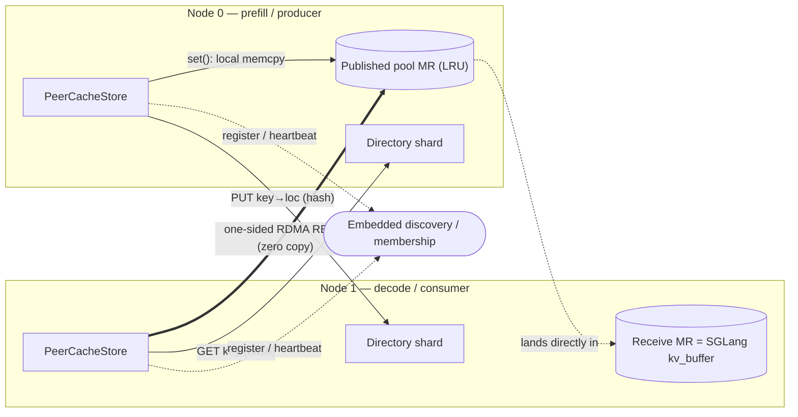

# PeerCache

**English** · [简体中文](README.zh.md)

[](https://github.com/flymysql/PeerCache/actions/workflows/ci.yml)
[](https://flymysql.github.io/PeerCache/)
[](LICENSE)

A lightweight, peer-to-peer **L3 storage backend for SGLang HiCache**, built for
**PD-disaggregated (prefill/decode) inference**: prefill workers publish KV pages,
decode workers read them back over RDMA with zero CPU copies.

Docs: <https://flymysql.github.io/PeerCache/>

PeerCache gives you Mooncake-style RDMA zero-copy KV-cache sharing across nodes,
but **without** the centralized `master` + `metadata` services. Instead it uses:

- **Embedded service discovery** — no separate meta process. One node (chosen by
  `discovery_addr`) auto-hosts the discovery service in-process; nodes register
  their endpoint, heartbeat, and pull the live membership list.
- **A consistent-hash distributed directory (DHT)** — the mapping
  `key -> {data_node, remote_addr, rkey, length}` is sharded across all nodes by
  hashing the key. There is no central metadata store.
- **Data stays local on write** — `set()` copies the page into a node-local
  *published pool* (a host memcpy, no network, no master) and pushes only a tiny
  location record to the directory.
- **One-sided RDMA READ on read** — `get()` looks up the directory, then issues a
  zero-copy `IBV_WR_RDMA_READ` straight into SGLang's registered host buffer.
- **Concurrent multi-threaded I/O** — a per-peer channel pool (each an RC QP with
  its own completion queue) lets reader/writer threads run with no shared-CQ
  contention; the control plane parallelises directory lookups too.
- **Disk persistence tier (L4)** — pages evicted from memory spill to disk
  (default `/data/peercache/`, `100GB`) and are promoted back into the pool on a
  later read (locally or by a remote reader).
- **Built-in monitoring** — Prometheus `/metrics` + an embedded HTML dashboard
  (default port `31997`): hit rate, throughput, latency p50/p99, mem/disk usage.

## Architecture

PeerCache splits into a **C++ data plane** (raw RDMA verbs) and a **Python control
plane** (discovery, directory, pool). The meta node only tracks membership; the
`key -> location` map is sharded across every node by consistent hashing, and the
KV bytes never leave the node that produced them until a peer reads them directly.



```
write:  set() ── local memcpy ──> published pool MR
                └── PUT key->{node,addr,rkey,len} ──> directory shard (hash(key))
read:   get() ── GET key ──> directory shard ──> {node,addr,rkey,len}
                └── one-sided RDMA READ ──> local host buffer (zero copy)
```

- **C++ data plane** (`cpp/`): raw `libibverbs` + `librdmacm`. RC QPs, one-sided
  READ/WRITE, per-peer channel pool with private CQs for concurrency. Exposed to
  Python via `pybind11` as the `_peercache` module.
- **Python control plane** (`python/peercache/`): TCP RPC, service discovery,
  consistent-hash ring, distributed directory, and the published-pool with LRU.
- **TCP fallback transport**: a pure-Python transport that mirrors the RDMA API so
  the design can be validated end-to-end on machines without RDMA hardware.

### Two-MR model (correctness)

SGLang's host KV buffer is the L2 tier and is evicted/overwritten by HiCache, so we
cannot register *its* address into the directory directly (dangling reference). Each
node therefore registers **two memory regions**:

1. **Receive MR** = `mem_pool_host.kv_buffer` — destination of one-sided READ on `get`.
2. **Published pool MR** = a backend-owned host pool with LRU — source of READ on
   remote nodes. `set` memcpys the page into this pool (node-local, no network) and
   publishes its `addr+rkey+len` to the directory. Eviction from the pool deletes the
   corresponding directory entry, so a published address stays valid until evicted.

See the [Architecture docs](https://flymysql.github.io/PeerCache/architecture/) for
the full design.

### Why simpler than Mooncake?

| | Mooncake | PeerCache |
|---|---|---|
| metadata | central master + metadata service | sharded directory (consistent hash) |
| data placement | dedicated managed pool | stays on producing node |
| coordination | master allocates / tracks objects | only service discovery on meta node |
| transfer | RDMA zero-copy | RDMA zero-copy (one-sided READ) |

## Install

### From PyPI (recommended)

```bash
pip install peercache
```

This builds the C++ data plane from source, so the target host needs a C++17
toolchain, CMake ≥ 3.18, and the RDMA dev headers (`libibverbs` / `librdmacm`,
e.g. `rdma-core` or Mellanox OFED). If those headers are absent, the build
automatically falls back to a stub module and the pure-Python TCP transport.

To force the no-RDMA build explicitly (control plane + TCP fallback only, e.g. on
a laptop or in CI):

```bash
pip install peercache --config-settings=cmake.define.PEERCACHE_NO_RDMA=ON
```

### From source

```bash
git clone https://github.com/flymysql/PeerCache.git
cd PeerCache
pip install .                 # or: pip install -e ".[test]"
```

## Run with SGLang

The meta service is **embedded** — there is no separate meta process. Point
`discovery_addr` at one node's IP on every node; the node whose IP matches
auto-starts the discovery service in-process.

```bash
# On every SGLang node, set discovery_addr to the SAME node's IP (say node-0).
# node-0 detects the IP is itself and hosts the embedded meta automatically.
python -m sglang.launch_server --enable-hierarchical-cache \
  --hicache-storage-backend dynamic \
  --hicache-storage-backend-extra-config \
  '{"backend_name":"peercache","module_path":"peercache.store","class_name":"PeerCacheStore","discovery_addr":"NODE0_IP:31998","protocol":"rdma","device_name":"mlx5_0","global_segment_size":"4gb"}'
```

(Optionally, you can still run a standalone meta with `peercache-meta --bind
0.0.0.0:31998` if you prefer a dedicated discovery host.)

See [examples/sglang_launch.md](examples/sglang_launch.md) for details.

## Benchmarks

A systematic benchmark suite ships **inside the package** and is exposed as a
single console command (no repo clone, no `PYTHONPATH`). It drives PeerCache's
`HiCacheStorage` interface exactly as **SGLang HiCache** does (PD-disaggregated
`batch_set_v1` / `batch_exists` / `batch_get_v1`) and reports throughput
(pages/s, tokens/s, GB/s) and latency tail (p50/p95/p99/p999/max) across a sweep
of thread models, including the full-load saturation/peak throughput.

### Measured baseline (cross-host RDMA, GET, MLA)

On 2× AMD EPYC 9K84 + 8× ConnectX-7 (RoCEv2, MTU 4096, MLNX_OFED 5.8):

| scenario | GET throughput |
|---|---|
| single NIC, PeerCache | **46.0 GB/s** (368 Gbps) — **~94%** of bare `ib_read_bw` (49.0 GB/s) |
| single process, 8 rails (1 MiB pages) | **147.6 GB/s** (1.18 Tbps) |
| full machine, 8 NICs, multi-process | **273.0 GB/s** (≈ 2.18 Tbps) |


Methodology, charts, and reproduce commands:
[Performance baseline](https://flymysql.github.io/PeerCache/performance/).

```bash
pip install peercache

# RDMA hardware (publishable numbers)
peercache-bench suite --device-name mlx5_0 --layout mla --page-size 131072 \
    --batch-size 32 --concurrencies 1,2,4,8,16,32,64 --duration 10 --tag rdma
```

`peercache-bench` subcommands: `latency`, `throughput`, `saturation`, `suite`
(SGLang-HiCache), plus `micro`, `mooncake`, `compare`.

> **RDMA-first.** PeerCache is built on RDMA one-sided READ; publishable figures
> must be measured on RDMA hardware. The TCP fallback is for functional smoke
> testing only and must not be quoted. See the
> [bench README](python/peercache/bench/README.md) and the
> [Benchmarks docs](https://flymysql.github.io/PeerCache/benchmarks/) for the
> methodology, thread models, metric definitions, and reproduction recipe.

## Test

```bash
pip install -e ".[test]"
pytest -q
```

## Maintainer setup (one-time)

- **GitHub Pages**: Settings → Pages → Build and deployment → Source = **GitHub
  Actions**. The `Docs` workflow then publishes to
  <https://flymysql.github.io/PeerCache/> on every push to `main`.
- **PyPI Trusted Publishing**: on the PyPI `peercache` project, add a GitHub
  publisher (owner `flymysql`, repo `PeerCache`, workflow `release.yml`,
  environment `pypi`). Tagging `vX.Y.Z` then builds the sdist, attaches it to a
  GitHub Release, and publishes to PyPI. Until configured, the PyPI step is
  non-blocking and the GitHub Release still ships the package.
