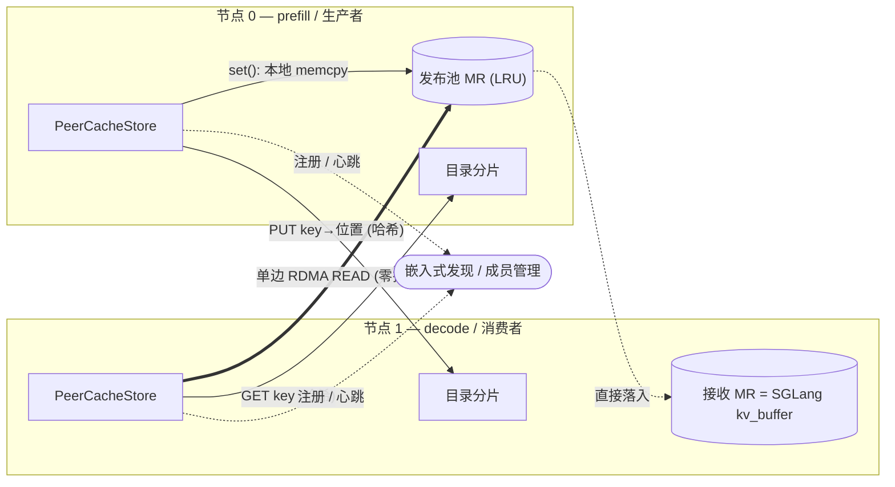

# PeerCache

[English](README.md) · **简体中文**

[](https://github.com/flymysql/PeerCache/actions/workflows/ci.yml)
[](https://flymysql.github.io/PeerCache/)
[](LICENSE)

一个轻量的、点对点（P2P）的 **SGLang HiCache L3 存储后端**，面向
**PD 解耦（prefill/decode）推理**：prefill 节点发布 KV 页，decode 节点经 RDMA 零 CPU 拷贝读回。

文档：<https://flymysql.github.io/PeerCache/>

PeerCache 提供 Mooncake 风格的 RDMA 零拷贝跨节点 KV-cache 共享，但**无需**中心化的
`master` + `metadata` 服务。它采用：

- **嵌入式服务发现** —— 没有独立的 meta 进程。由 `discovery_addr` 指定的某个节点在进程内
  自动托管发现服务；各节点注册自己的 endpoint、发送心跳并拉取实时成员列表。
- **一致性哈希分布式目录（DHT）** —— 映射
  `key -> {data_node, remote_addr, rkey, length}` 通过对 key 哈希分片到所有节点，
  没有中心化的元数据存储。
- **写入时数据留在本地** —— `set()` 把页拷贝进本节点的*发布池*（一次 host memcpy，
  无网络、无 master），只向目录推送一条很小的位置记录。
- **读取时单边 RDMA READ** —— `get()` 查目录后，发起零拷贝 `IBV_WR_RDMA_READ`，
  直接写入 SGLang 已注册的 host buffer。
- **并发多线程 I/O** —— 按对端维护通道池（每个通道是带独立完成队列的 RC QP），
  读/写线程之间无共享 CQ 争用；控制面也并行化了目录查询。
- **磁盘持久化分层（L4）** —— 从内存淘汰的页落盘（默认 `/data/peercache/`、`100GB`），
  下次读取时再被提升回池中（本地或被远端读者触发）。
- **内置监控** —— Prometheus `/metrics` + 内嵌 HTML 仪表盘（默认端口 `31997`）：
  命中率、吞吐、延迟 p50/p99、内存/磁盘占用。

## 架构

PeerCache 分为 **C++ 数据平面**（裸 RDMA verbs）与 **Python 控制平面**（发现、目录、池）。
meta 节点只跟踪成员关系；`key -> 位置` 的映射通过一致性哈希分片到每个节点，KV 字节在被对端
直接读取之前，始终留在产生它的节点上。



```
写：  set() ── 本地 memcpy ──> 发布池 MR
              └── PUT key->{node,addr,rkey,len} ──> 目录分片 (hash(key))
读：  get() ── GET key ──> 目录分片 ──> {node,addr,rkey,len}
              └── 单边 RDMA READ ──> 本地 host buffer（零拷贝）
```

- **C++ 数据平面**（`cpp/`）：裸 `libibverbs` + `librdmacm`。RC QP、单边 READ/WRITE、
  按对端的通道池 + 私有 CQ 以支持并发。通过 `pybind11` 暴露为 `_peercache` 模块。
- **Python 控制平面**（`python/peercache/`）：TCP RPC、服务发现、一致性哈希环、
  分布式目录，以及带 LRU 的发布池。
- **TCP 回退传输**：纯 Python 实现、镜像 RDMA API，便于在无 RDMA 硬件的机器上端到端验证设计。

### 双 MR 模型（正确性）

SGLang 的 host KV buffer 属于 L2 层，会被 HiCache 淘汰/覆写，因此不能把*它的*地址直接登记到目录里
（悬垂引用）。每个节点因此注册**两块内存区域（MR）**：

1. **接收 MR** = `mem_pool_host.kv_buffer` —— `get` 时单边 READ 的目标地址。
2. **发布池 MR** = 后端自有、带 LRU 的 host 池 —— 远端 READ 的来源。`set` 把页 memcpy 进该池
   （本节点内、无网络），并把 `addr+rkey+len` 发布到目录。池中淘汰会删除对应目录项，
   因此一个已发布地址在被淘汰前始终有效。

完整设计见 [架构文档](https://flymysql.github.io/PeerCache/zh/architecture/)。

### 为什么比 Mooncake 更简单？

| | Mooncake | PeerCache |
|---|---|---|
| 元数据 | 中心 master + metadata 服务 | 分片目录（一致性哈希） |
| 数据放置 | 专门的托管池 | 留在生产节点上 |
| 协调 | master 分配/跟踪对象 | 仅 meta 节点上的服务发现 |
| 传输 | RDMA 零拷贝 | RDMA 零拷贝（单边 READ） |

## 安装

### 从 PyPI 安装（推荐）

```bash
pip install peercache
```

该过程会从源码构建 C++ 数据平面，因此目标主机需要 C++17 工具链、CMake ≥ 3.18，以及 RDMA 开发头文件
（`libibverbs` / `librdmacm`，如 `rdma-core` 或 Mellanox OFED）。若缺少这些头文件，构建会自动回退为
stub 模块并使用纯 Python TCP 传输。

如需显式构建无 RDMA 版本（仅控制面 + TCP 回退，例如笔记本或 CI）：

```bash
pip install peercache --config-settings=cmake.define.PEERCACHE_NO_RDMA=ON
```

### 从源码安装

```bash
git clone https://github.com/flymysql/PeerCache.git
cd PeerCache
pip install .                 # 或：pip install -e ".[test]"
```

## 配合 SGLang 运行

meta 服务是**内嵌的**——没有独立的 meta 进程。在每个节点把 `discovery_addr` 指向同一个节点的 IP；
IP 与之匹配的节点会在进程内自动启动发现服务。

```bash
# 在每个 SGLang 节点，把 discovery_addr 设为同一个节点（如 node-0）的 IP。
# node-0 检测到该 IP 是自己，于是自动托管内嵌 meta。
python -m sglang.launch_server --enable-hierarchical-cache \
  --hicache-storage-backend dynamic \
  --hicache-storage-backend-extra-config \
  '{"backend_name":"peercache","module_path":"peercache.store","class_name":"PeerCacheStore","discovery_addr":"NODE0_IP:31998","protocol":"rdma","device_name":"mlx5_0","global_segment_size":"4gb"}'
```

（也可以用 `peercache-meta --bind 0.0.0.0:31998` 单独运行一个 meta，如果你更喜欢专用的发现主机。）

详见 [examples/sglang_launch.md](examples/sglang_launch.md)。

## 性能基准测试

包内自带一套系统化基准测试，并以**单一命令**暴露（无需克隆仓库、无需设 `PYTHONPATH`）。它**完全按照
SGLang HiCache 的方式**调用 PeerCache 的 `HiCacheStorage` 接口（PD 解耦的
`batch_set_v1` / `batch_exists` / `batch_get_v1`），并报告吞吐（pages/s、tokens/s、GB/s）与延迟尾部
（p50/p95/p99/p999/max），覆盖一系列线程模型的扫描，包括满负载的饱和/峰值吞吐。

### 实测基线（跨机 RDMA，GET，MLA）

在 2× AMD EPYC 9K84 + 8× ConnectX-7（RoCEv2，MTU 4096，MLNX_OFED 5.8）上：

| 场景 | GET 吞吐 |
|---|---|
| 单卡，PeerCache | **46.0 GB/s**（368 Gbps）—— 裸 `ib_read_bw`（49.0 GB/s）的 **~94%** |
| 单进程，8 rail（1 MiB 页） | **147.6 GB/s**（1.18 Tbps） |
| 整机，8 卡，多进程 | **413.1 GB/s**（≈ 3.3 Tbps） |


方法论、图表与复现命令见
[性能基线](https://flymysql.github.io/PeerCache/zh/performance/)。

```bash
pip install peercache

# RDMA 硬件（可对外发布的数字）
peercache-bench suite --device-name mlx5_0 --layout mla --page-size 131072 \
    --batch-size 32 --concurrencies 1,2,4,8,16,32,64 --duration 10 --tag rdma
```

`peercache-bench` 子命令：`latency`、`throughput`、`saturation`、`suite`（SGLang-HiCache），
以及 `micro`、`mooncake`、`compare`。

> **RDMA 优先。** PeerCache 基于 RDMA 单边 READ；可发布的数字必须在 RDMA 硬件上测得。
> TCP 回退仅用于功能冒烟测试，不能对外引用。方法论、线程模型、指标定义与复现步骤见
> [bench README](python/peercache/bench/README.md) 与
> [性能基准测试文档](https://flymysql.github.io/PeerCache/zh/benchmarks/)。

## 测试

```bash
pip install -e ".[test]"
pytest -q
```

## 维护者一次性配置

- **GitHub Pages**：Settings → Pages → Build and deployment → Source = **GitHub
  Actions**。之后 `Docs` 工作流会在每次推送到 `main` 时发布到
  <https://flymysql.github.io/PeerCache/>。
- **PyPI Trusted Publishing**：在 PyPI 的 `peercache` 项目里添加 GitHub publisher
  （owner `flymysql`、repo `PeerCache`、workflow `release.yml`、environment `pypi`）。
  打 `vX.Y.Z` 标签后会构建 sdist、附加到 GitHub Release 并发布到 PyPI。在配置完成之前，
  PyPI 步骤不阻塞，GitHub Release 仍会带上包。
