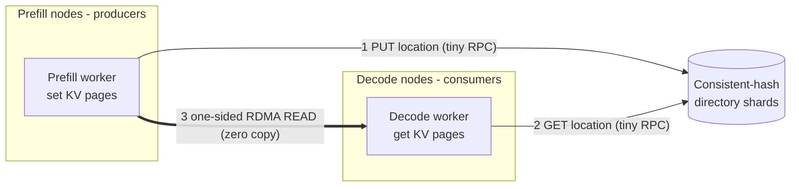
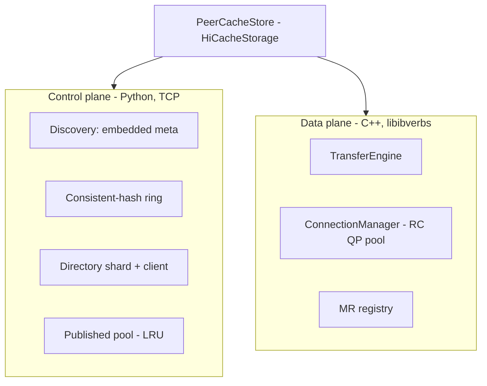
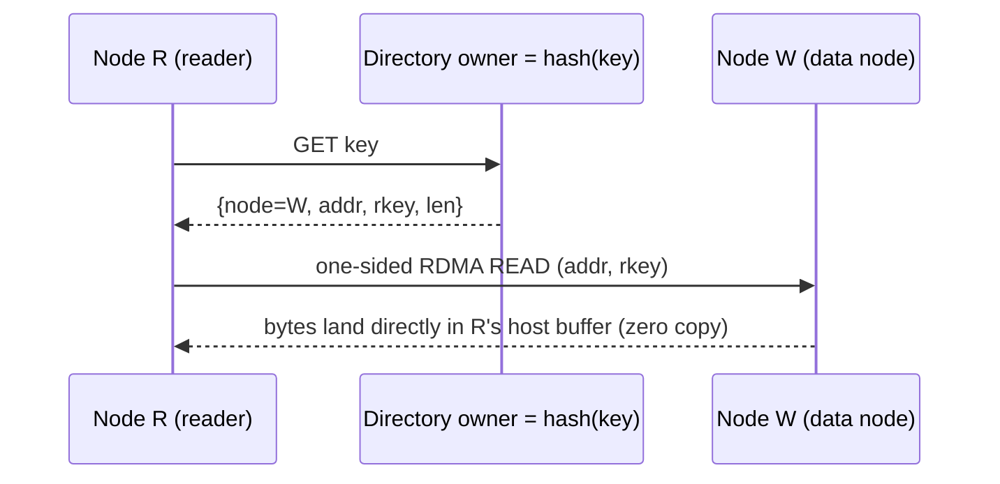

# Architecture

## Primary use case: PD-disaggregated SGLang inference

PeerCache is built for **prefill/decode (PD) disaggregated** SGLang deployments,
where prefill workers and decode workers run on different nodes. The prefill
worker computes the prompt KV cache; the decode worker must obtain that KV cache
to continue generation. PeerCache is the L3 storage that moves those KV pages
between nodes with **RDMA zero-copy**, so decode reads the prefill KV directly
out of remote host memory — no central master, no extra network copy of the KV.



- The **KV data stays on the prefill node** (the producer). Only a small location
  record is published to the directory.
- The **decode node pulls** the KV via one-sided RDMA READ straight into its own
  registered host buffer.
- It also works for the non-disaggregated case (any node can be producer and
  consumer); PD disaggregation is just the scenario it is tuned for.

## Control plane vs data plane

PeerCache splits cleanly into a **control plane** (Python) and a **data plane**
(C++ / RDMA).



## Two-MR model

SGLang's host KV buffer is the L2 tier and is evicted/overwritten by HiCache, so
its address cannot be published into the directory directly (dangling reference).
Each node therefore registers **two memory regions**:

1. **Receive MR** = `mem_pool_host.kv_buffer` — the destination of one-sided READ
   on `get`.
2. **Published pool MR** = a backend-owned host pool with LRU — the source of READ
   on remote nodes. `set` memcpys the page into this pool (node-local, no network)
   and publishes its `addr + rkey + len` to the directory. Eviction from the pool
   deletes the corresponding directory entry, so a published address stays valid
   until it is evicted.

## Write path

```mermaid
sequenceDiagram
    participant W as Node W (producer)
    participant Dw as Directory owner = hash(key)
    W->>W: set(): local memcpy page -> published pool MR
    W->>Dw: PUT key -> {node, addr, rkey, len}
    Note over W,Dw: data never leaves W; only a tiny record is sent
```

Write cost = one local memcpy + one small directory RPC. No master, no network
copy of the KV data.

## Read path



If the directory says the data lives on the reader itself, the read degrades to a
local `memcpy` with no network involved.

## Copy counts

The whole point is to minimize copies of the (large) KV data. Counting only KV
**data** movement (the directory RPCs carry a few dozen bytes and are ignored):

| Operation | KV-data copies | What happens |
|---|---|---|
| `set` (write, producer) | **1 host memcpy** | page copied from SGLang's host KV buffer into the backend's published-pool MR (node-local, no network) |
| `get` (remote read) | **0 CPU copies** | one-sided `IBV_WR_RDMA_READ`; the NIC DMAs bytes from the remote published pool straight into the reader's host KV buffer (true zero-copy) |
| `get` (data already local) | **1 host memcpy** | published pool → host KV buffer; no network |

So a producer→consumer KV transfer costs **one host-side memcpy on write + one
zero-copy RDMA READ on read** — the data crosses the network exactly once, with
no CPU involvement on either side during the transfer (the NIC does the DMA).

### Why the one write-side memcpy is necessary

SGLang's host KV buffer is the L2 tier and is **evicted/overwritten** by HiCache.
If we published its address directly, a remote READ could land on a page that has
since been reused (dangling reference / corruption). The backend-owned published
pool is LRU-managed and decoupled from L2: publishing into it costs one memcpy but
guarantees the `addr + rkey` stays valid until the pool itself evicts the entry
(which also deletes the directory record). This is the standard trade-off for
correctness; the network transfer itself remains zero-copy.

## Consistent-hash directory

- Each node hosts one **shard** of the directory: a local `key -> DataLocation`
  map. The union of all shards is the directory; there is no central store.
- A virtual-node ring (default 160 vnodes/node) decides the owner of each key, so
  writers and readers independently agree on where a key's entry lives.
- `directory_replicas > 1` writes each entry to the next N owners for HA; reads
  fall back through replicas.

## Connection management

- Connection bootstrap uses a tiny TCP handshake (exchange of `QpInfo`:
  qp_num / psn / lid / gid), fully decoupling device selection from connection
  setup. The QP then transitions INIT → RTR → RTS.
- One RC QP per peer, created lazily and pooled, avoiding O(N²) eager meshes.
- A shared completion queue is drained per batch; completions are matched to
  requests by `wr_id`.

## Failure handling and trade-offs

- **Eviction races**: pool eviction deletes the directory entry; any read that
  resolves a stale/missing entry returns a miss so SGLang recomputes (safe
  degradation).
- **Embedded meta**: there is no dedicated meta machine. The node whose IP equals
  `discovery_addr` auto-hosts the discovery service in-process (others connect as
  clients). It is a single point for *discovery only*. Membership is cached
  locally, so a brief meta outage does not interrupt established reads/writes. If
  the discovery host dies, restart it on the same IP — established peers keep
  serving from their cached membership in the meantime.
- **Directory durability**: with a single replica, a node failure loses that
  shard's location records (and the data, which lived on that node anyway) — an
  acceptable cache miss. Use `directory_replicas > 1` for redundancy.
