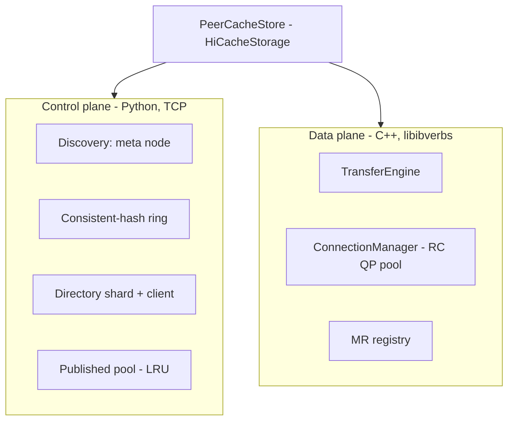
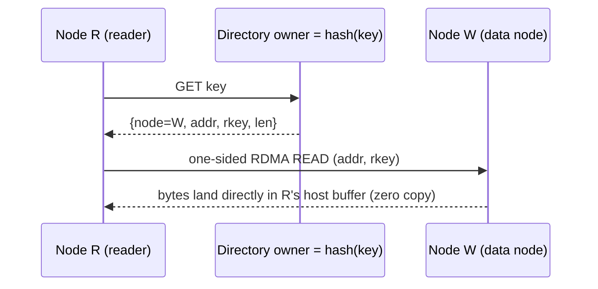

# Architecture

PeerCache splits cleanly into a **control plane** (Python) and a **data plane**
(C++ / RDMA).



## Two-MR model

SGLang's host KV buffer is the L2 tier and is evicted/overwritten by HiCache, so
its address cannot be published into the directory directly (dangling reference).
Each node therefore registers **two memory regions**:

1. **Receive MR** = `mem_pool_host.kv_buffer` — the destination of one-sided READ
   on `get`.
2. **Published pool MR** = a backend-owned host pool with LRU — the source of READ
   on remote nodes. `set` memcpys the page into this pool (node-local, no network)
   and publishes its `addr + rkey + len` to the directory. Eviction from the pool
   deletes the corresponding directory entry, so a published address stays valid
   until it is evicted.

## Write path

```mermaid
sequenceDiagram
    participant W as Node W (producer)
    participant Dw as Directory owner = hash(key)
    W->>W: set(): local memcpy page -> published pool MR
    W->>Dw: PUT key -> {node, addr, rkey, len}
    Note over W,Dw: data never leaves W; only a tiny record is sent
```

Write cost = one local memcpy + one small directory RPC. No master, no network
copy of the KV data.

## Read path



If the directory says the data lives on the reader itself, the read degrades to a
local `memcpy` with no network involved.

## Consistent-hash directory

- Each node hosts one **shard** of the directory: a local `key -> DataLocation`
  map. The union of all shards is the directory; there is no central store.
- A virtual-node ring (default 160 vnodes/node) decides the owner of each key, so
  writers and readers independently agree on where a key's entry lives.
- `directory_replicas > 1` writes each entry to the next N owners for HA; reads
  fall back through replicas.

## Connection management

- Connection bootstrap uses a tiny TCP handshake (exchange of `QpInfo`:
  qp_num / psn / lid / gid), fully decoupling device selection from connection
  setup. The QP then transitions INIT → RTR → RTS.
- One RC QP per peer, created lazily and pooled, avoiding O(N²) eager meshes.
- A shared completion queue is drained per batch; completions are matched to
  requests by `wr_id`.

## Failure handling and trade-offs

- **Eviction races**: pool eviction deletes the directory entry; any read that
  resolves a stale/missing entry returns a miss so SGLang recomputes (safe
  degradation).
- **Meta node**: a single point for *discovery*. Membership is cached locally, so
  a brief meta outage does not interrupt established reads/writes. A standby can
  be added later.
- **Directory durability**: with a single replica, a node failure loses that
  shard's location records (and the data, which lived on that node anyway) — an
  acceptable cache miss. Use `directory_replicas > 1` for redundancy.
