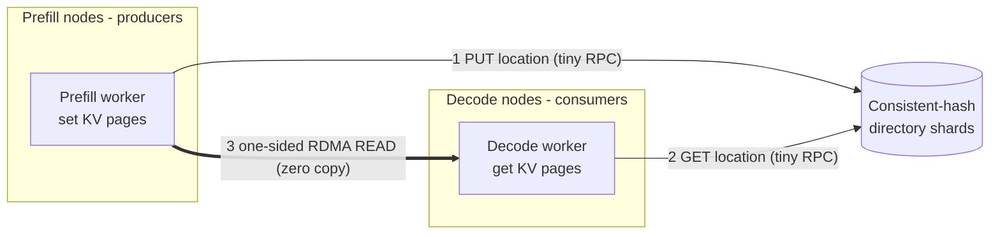
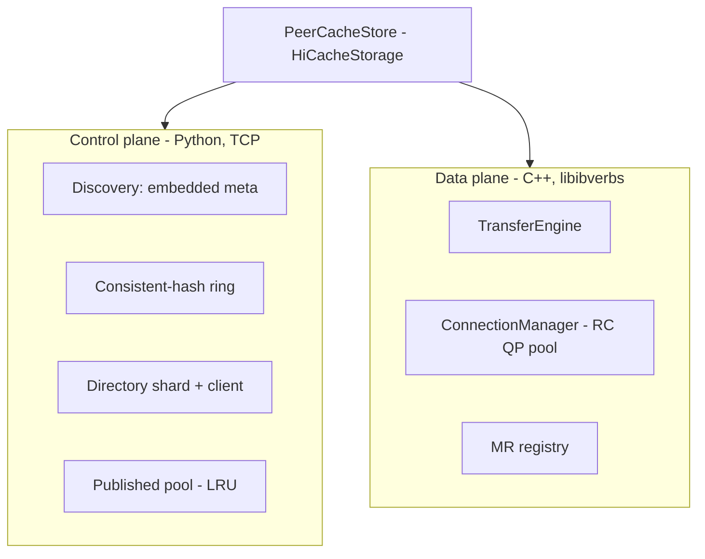
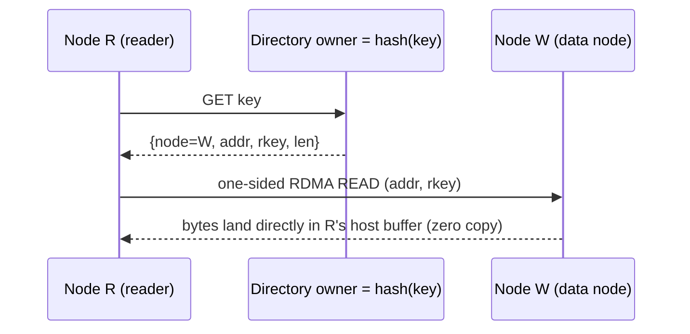
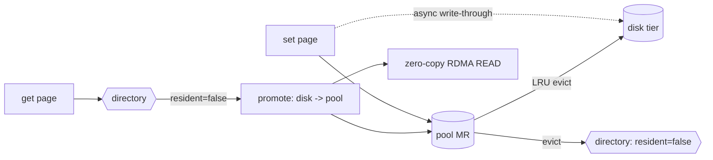

# Architecture

## Primary use case: PD-disaggregated SGLang inference

PeerCache is built for **prefill/decode (PD) disaggregated** SGLang deployments,
where prefill workers and decode workers run on different nodes. The prefill
worker computes the prompt KV cache; the decode worker must obtain that KV cache
to continue generation. PeerCache is the L3 storage that moves those KV pages
between nodes with **RDMA zero-copy**, so decode reads the prefill KV directly
out of remote host memory — no central master, no extra network copy of the KV.



- The **KV data stays on the prefill node** (the producer). Only a small location
  record is published to the directory.
- The **decode node pulls** the KV via one-sided RDMA READ straight into its own
  registered host buffer.
- It also works for the non-disaggregated case (any node can be producer and
  consumer); PD disaggregation is just the scenario it is tuned for.

## Control plane vs data plane

PeerCache splits cleanly into a **control plane** (Python) and a **data plane**
(C++ / RDMA).



## Two-MR model

SGLang's host KV buffer is the L2 tier and is evicted/overwritten by HiCache, so
its address cannot be published into the directory directly (dangling reference).
Each node therefore registers **two memory regions**:

1. **Receive MR** = `mem_pool_host.kv_buffer` — the destination of one-sided READ
   on `get`.
2. **Published pool MR** = a backend-owned host pool with LRU — the source of READ
   on remote nodes. `set` memcpys the page into this pool (node-local, no network)
   and publishes its `addr + rkey + len` to the directory. Eviction from the pool
   deletes the corresponding directory entry, so a published address stays valid
   until it is evicted.

## Write path

```mermaid
sequenceDiagram
    participant W as Node W (producer)
    participant Dw as Directory owner = hash(key)
    W->>W: set(): local memcpy page -> published pool MR
    W->>Dw: PUT key -> {node, addr, rkey, len}
    Note over W,Dw: data never leaves W; only a tiny record is sent
```

Write cost = one local memcpy + one small directory RPC. No master, no network
copy of the KV data.

## Read path



If the directory says the data lives on the reader itself, the read degrades to a
local `memcpy` with no network involved.

## Copy counts

The whole point is to minimize copies of the (large) KV data. Counting only KV
**data** movement (the directory RPCs carry a few dozen bytes and are ignored):

| Operation | KV-data copies | What happens |
|---|---|---|
| `set` (write, producer) | **1 host memcpy** | page copied from SGLang's host KV buffer into the backend's published-pool MR (node-local, no network) |
| `get` (remote read) | **0 CPU copies** | one-sided `IBV_WR_RDMA_READ`; the NIC DMAs bytes from the remote published pool straight into the reader's host KV buffer (true zero-copy) |
| `get` (data already local) | **1 host memcpy** | published pool → host KV buffer; no network |

So a producer→consumer KV transfer costs **one host-side memcpy on write + one
zero-copy RDMA READ on read** — the data crosses the network exactly once, with
no CPU involvement on either side during the transfer (the NIC does the DMA).

### Why the one write-side memcpy is necessary

SGLang's host KV buffer is the L2 tier and is **evicted/overwritten** by HiCache.
If we published its address directly, a remote READ could land on a page that has
since been reused (dangling reference / corruption). The backend-owned published
pool is LRU-managed and decoupled from L2: publishing into it costs one memcpy but
guarantees the `addr + rkey` stays valid until the pool itself evicts the entry
(which also deletes the directory record). This is the standard trade-off for
correctness; the network transfer itself remains zero-copy.

## Disk persistence tier (L4)

The memory pool is bounded; once full, the LRU page would normally be lost. The
optional **disk tier** keeps evicted pages on local disk so they can be promoted
back later (locally or by a remote reader), greatly extending effective capacity.

- **Write-through (async)**: on `set`, after the page lands in the pool it is also
  enqueued for an async write to disk (`disk_path`, default `/data/peercache/`,
  capped at `disk_size`, default `100GB`, itself LRU-bounded).
- **Eviction → non-resident, not deleted**: when the pool evicts a page, its
  directory entry is *kept but marked `resident=false`* (the page is on disk). The
  entry is only deleted when the page is finally evicted from disk too.
- **Promote on read**: a `get` that resolves a non-resident entry triggers a
  *promote* — the owning node loads the page from disk back into the pool (one
  disk read + one memcpy), re-marks the directory entry resident, and serves it.
  - **Local** read: the node promotes its own page (prefetch back into the pool).
  - **Remote** read: the reader sends a `data_promote` RPC to the owner; the owner
    promotes from its disk into its pool and returns the fresh `{addr, rkey}`, then
    the reader issues the zero-copy RDMA READ as usual.
- **`exists` warming**: because non-resident entries stay in the directory,
  `exists` already reports a hit for disk-resident pages. On a hit it also kicks a
  best-effort async promote so the imminent `get` is warm.



Copy-count impact: write-through adds one extra host copy on `set` (page → disk,
on a background thread). A promote adds one disk read + one memcpy on the owner;
the cross-node transfer itself stays zero-copy. The disk tier is optional
(`disk_enabled`) and degrades gracefully (if `disk_path` cannot be created it is
disabled and the pool falls back to delete-on-evict).

## Monitoring (metrics + dashboard)

Each node optionally runs a metrics server (default on, port `31997`):

- `GET /metrics` — Prometheus text exposition for Prometheus/Grafana scraping.
- `GET /` — a built-in, dependency-free HTML dashboard (auto-refreshing) for quick
  inspection without a Prometheus stack.

Exposed signals include: pool bytes used / capacity / key count, disk bytes used /
key count, read hit rate, read/write request and byte counters (for windowed
rates via `rate()`), eviction/promote counters, and operation latency summaries
(p50/p90/p99 and average for read and write). Disable with `metrics_enabled`,
move it with `metrics_port`, or turn off just the HTML page with
`metrics_dashboard`.

## Consistent-hash directory

- Each node hosts one **shard** of the directory: a local `key -> DataLocation`
  map. The union of all shards is the directory; there is no central store.
- A virtual-node ring (default 160 vnodes/node) decides the owner of each key, so
  writers and readers independently agree on where a key's entry lives.
- `directory_replicas > 1` writes each entry to the next N owners for HA; reads
  fall back through replicas.

## Connection management

- Connection bootstrap uses a tiny TCP handshake (exchange of `QpInfo`:
  qp_num / psn / lid / gid), fully decoupling device selection from connection
  setup. The QP then transitions INIT → RTR → RTS.
- **Per-peer channel pool**: each peer has a bounded pool of *channels*, where a
  channel is one RC QP plus its **own private completion queue**. Channels are
  created lazily, reused via a free list, and capped at `max_channels_per_peer`.
  This avoids O(N²) eager meshes while still allowing several readers to the same
  peer at once.
- Within a batch, completions are matched to requests by `wr_id` and drained from
  that channel's own CQ.

## Concurrency model

PeerCache is safe and parallel on both sides under multi-threaded SGLang:

- **Server side** is already fully threaded: the control-plane RPC server, the
  data-plane responder (RDMA responder QPs / TCP serve loop), and the metrics
  server each handle requests on independent threads. One-sided RDMA READ needs
  no responder CPU at all.
- **Client read parallelism**: `batch_read` releases the Python GIL for the
  entire RDMA transfer. Each call leases an independent channel per peer (QP +
  private CQ), so N reader threads post and poll on N separate CQs with zero
  shared-CQ contention. Reaching the cap simply makes extra threads wait briefly
  for a channel to be released.
- **Client control parallelism**: the RPC client pool and (in TCP fallback) the
  socket pool lease a connection per in-flight call, so directory lookups and
  promotes to the same owner run concurrently instead of serializing on one
  socket. A connection is only returned to the pool after a clean call; broken
  connections are closed, never reused.
- **Shared state**: the published pool, disk index, and the `key → length` map
  are guarded by locks, so concurrent `set`/`get`/eviction callbacks stay
  consistent.

Tune `max_channels_per_peer` (default 16) to trade memory (QPs/CQs/sockets) for
read concurrency to a single hot peer.

## Failure handling and trade-offs

- **Eviction races**: pool eviction deletes the directory entry; any read that
  resolves a stale/missing entry returns a miss so SGLang recomputes (safe
  degradation).
- **Embedded multi-master discovery**: there is no dedicated meta machine and no
  single point of failure. Every host runs a discovery server on the meta port;
  the active masters are the `max_masters` (default 3) hosts, with the configured
  `discovery_addr` head pinned first and the rest promoted in hostname order as
  nodes join. A non-head master that dies is replaced automatically; membership is
  also cached locally, so a brief master outage never interrupts established
  reads/writes. If the head itself dies, established peers keep serving via the
  other masters — restart the head only so brand-new nodes can bootstrap.
- **Directory durability**: `directory_replicas` defaults to **2**, so a single
  node loss does not drop a shard's location records before the ring re-shards
  (each producer re-publishes its pages on a membership change). Worst case a
  resolve returns a miss and SGLang recomputes — safe degradation.
