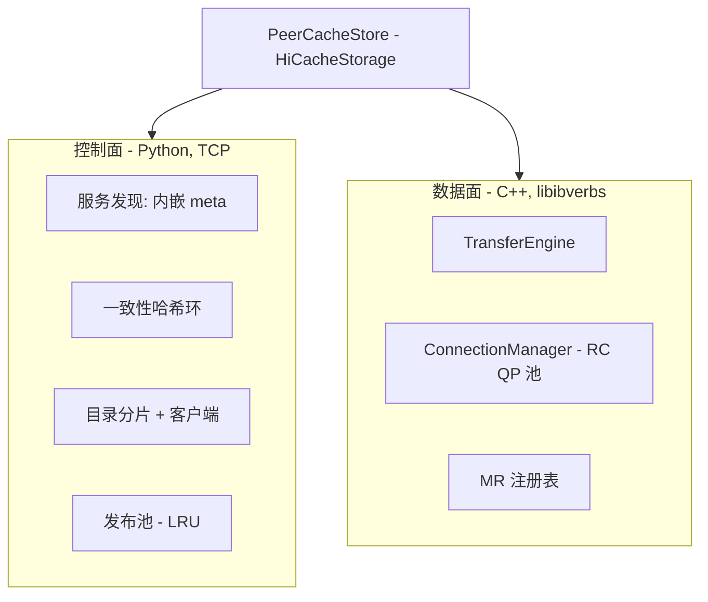
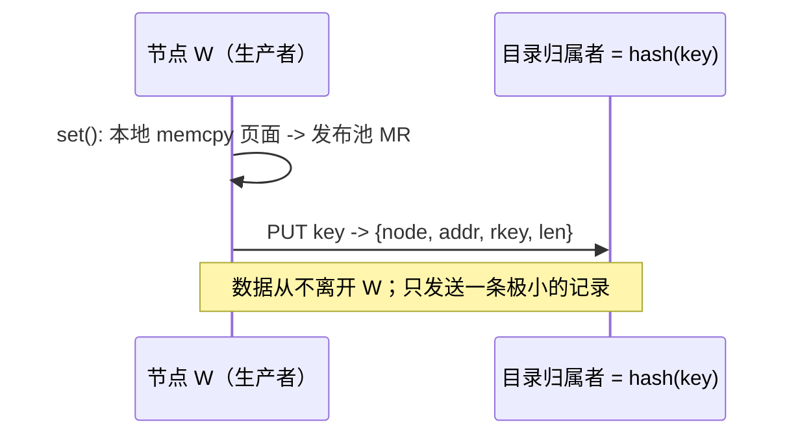
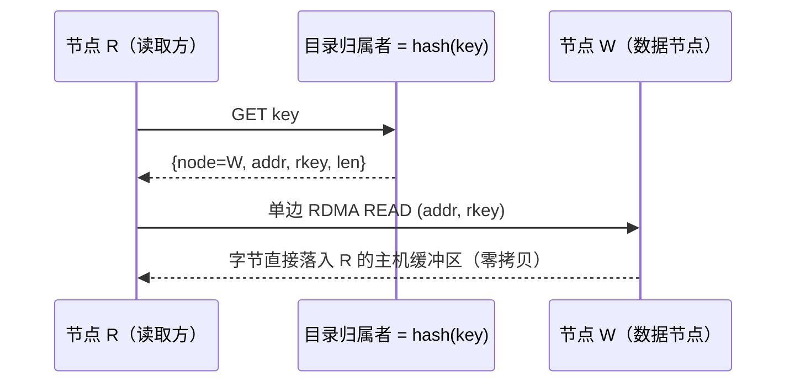

# 架构

PeerCache 清晰地分为**控制面**（Python）与**数据面**（C++ / RDMA）。

## 双 MR 模型

SGLang 的主机 KV 缓冲区是 L2 层，会被 HiCache 驱逐/覆盖，因此其地址不能直接发布到
目录里（会成为悬空引用）。为此每个节点注册**两个内存区域（MR）**：

1. **接收 MR** = `mem_pool_host.kv_buffer` —— `get` 时单边 READ 的目标。
2. **发布池 MR** = 后端自有、带 LRU 的主机内存池 —— 远端节点 READ 的来源。`set` 把
   页面 memcpy 进该池（节点本地、不走网络），并把 `addr + rkey + len` 发布到目录。
   从池中驱逐会删除对应的目录条目，因此已发布的地址在被驱逐前始终有效。

## 写入路径

写入开销 = 一次本地 memcpy + 一次小的目录 RPC。没有 master，也没有 KV 数据的网络拷贝。

## 读取路径

如果目录显示数据就在读取方自身，读取会退化为一次本地 `memcpy`，完全不走网络。

## 一致性哈希目录

- 每个节点承载目录的一个**分片**：本地的 `key -> DataLocation` 映射。所有分片的
  并集构成完整目录；不存在中心存储。
- 虚拟节点环（默认每节点 160 个 vnode）决定每个 key 的归属者，从而让写入方与读取方
  独立地就 key 条目所在位置达成一致。
- `directory_replicas > 1` 会把每条条目写入接下来的 N 个归属者以实现高可用；读取在
  副本之间回退。

## 连接管理

- 连接引导使用极小的 TCP 握手（交换 `QpInfo`：qp_num / psn / lid / gid），将设备选择
  与连接建立完全解耦。随后 QP 经历 INIT → RTR → RTS 状态迁移。
- 每个对端一条 RC QP，惰性创建并池化，避免 O(N²) 的全连接网格。
- 共享完成队列按批次轮询；完成项通过 `wr_id` 匹配到对应请求。

## 故障处理与权衡

- **驱逐竞争**：池驱逐会删除目录条目；任何解析到陈旧/缺失条目的读取都会返回 miss，
  让 SGLang 重新计算（安全降级）。
- **内嵌 meta**：没有专用的 meta 机器。IP 等于 `discovery_addr` 的节点在进程内自动
  承担服务发现（其余节点作为客户端连接）。它只是*服务发现*的单点。成员信息在本地
  缓存，因此短暂的 meta 中断不会影响已建立的读写。若发现主机宕机，在相同 IP 上重启
  即可 —— 期间已连接的对端仍可凭缓存的成员信息继续服务。
- **目录持久性**：单副本时，节点故障会丢失该分片的位置记录（以及本就在该节点上的
  数据）—— 这是可接受的缓存 miss。需要冗余时使用 `directory_replicas > 1`。
