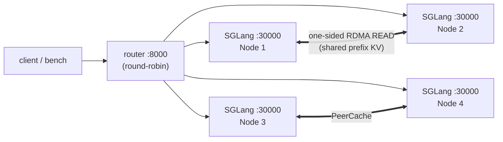

# Demo: multi-node prefix-cache reuse

A step-by-step walkthrough that brings up **4 SGLang nodes sharing one prefix /
KV cache through PeerCache** (aggregated, **non-PD**) and then *proves* the
cross-node cache hits with metrics.

!!! info "What this demo shows"
    Several inference nodes computing a shared prefix only **once** and reusing
    its KV across the cluster over RDMA — no central master, no PD transfer
    engine. You will watch PeerCache's `write_requests`, `read_hits` and
    `read_remote_hits` counters climb.

## Topology

| Role | Host | Notes |
|---|---|---|
| Node 1 | `<NODE1_IP>` | also hosts the embedded PeerCache meta **and** the router |
| Node 2 | `<NODE2_IP>` | |
| Node 3 | `<NODE3_IP>` | |
| Node 4 | `<NODE4_IP>` | |



## Prerequisites

- 4 hosts with an **RDMA NIC** (RoCE/IB), mutually reachable. Note your device
  name(s), e.g. `mlx5_0` or `mlx5_bond_1..8` — and use the **same order on every
  node** (rails pair by index).
- **SGLang** installed (with `--enable-hierarchical-cache` support).
- A model and a tokenizer available at the same path on every node.
- TCP reachability between nodes on the discovery port (`31998`), the server
  port (`30000`), the router port (`8000`) and the metrics port (`31997`).

## Step 1 — install PeerCache on all 4 nodes

```bash
pip install -U peercache            # RDMA build (needs libibverbs/librdmacm)
python -c "from peercache import _peercache as m; assert m.HAS_RDMA, 'expected RDMA build'"
ulimit -l unlimited                 # allow pinning RDMA memory
```

## Step 2 — set the shared variables on every node

Set these in each node's shell. **Only `SELF` differs per node.**

```bash
MODEL=/path/to/your/model                 # same path on every node
DEVS=mlx5_bond_1,mlx5_bond_2,mlx5_bond_3,mlx5_bond_4,mlx5_bond_5,mlx5_bond_6,mlx5_bond_7,mlx5_bond_8
DISC=<NODE1_IP>:31998                      # SAME on all nodes; Node 1 auto-hosts the meta
SELF=<this node's IP>                      # e.g. <NODE1_IP> on node 1, <NODE2_IP> on node 2 ...
TP=1                                       # raise if the model needs >1 GPU

PC='{"backend_name":"peercache","module_path":"peercache.store","class_name":"PeerCacheStore","discovery_addr":"'$DISC'","protocol":"rdma","device_names":"'$DEVS'","local_hostname":"'$SELF'","global_segment_size":"16gb"}'
```

!!! tip "Single NIC?"
    Replace `"device_names":"'$DEVS'"` with `"device_name":"mlx5_0"` (and skip
    `DEVS`). Multi-rail (`device_names`) stripes across NICs for more bandwidth.

## Step 3 — start one SGLang server per node

Run this on **all four** nodes (start **Node 1 first** — it hosts the meta).

```bash
pkill -9 -f sglang; sleep 2                       # free any stale GPU memory
export PYTORCH_CUDA_ALLOC_CONF=expandable_segments:True

CUDA_VISIBLE_DEVICES=0 python -m sglang.launch_server \
  --model-path $MODEL --tp-size $TP --trust-remote-code \
  --host 0.0.0.0 --port 30000 \
  --enable-hierarchical-cache \
  --hicache-write-policy write_through \
  --hicache-ratio 1.2 \
  --hicache-storage-backend dynamic \
  --hicache-storage-backend-extra-config "$PC"
```

Why these flags matter for the demo:

- `--hicache-write-policy write_through` — **publish KV to PeerCache as it is
  produced**, instead of only on host-cache eviction. Without this the L3 cache
  often stays empty (`write_requests=0`) when the host tier is large.
- `--hicache-ratio 1.2` — keep the host (L2) tier small so pages actually flow
  down to the PeerCache (L3) tier.

In each server log you should see PeerCache come up:

```
This node hosts the embedded PeerCache meta/discovery service on 0.0.0.0:31998   (Node 1 only)
PeerCacheStore up: node=<ip>-xxxx rdma=<ip>:<port> control=<ip>:<port> discovery=<NODE1_IP>:31998
PeerCacheStore registered MRs: recv=... bytes, pool=17179869184 bytes
```

!!! warning "Must NOT say 'using TCP fallback'"
    If you see `RDMA transport unavailable ... using TCP fallback`, RDMA didn't
    initialise — fix the device name / GID before continuing (TCP is functional
    but not a performance path). Also confirm the `registered MRs ... pool=...`
    line appears; if it's missing, PeerCache never received the host pool.

## Step 4 — start the router on Node 1

```bash
python -m sglang_router.launch_server \
  --worker-urls http://<NODE1_IP>:30000 http://<NODE2_IP>:30000 \
                http://<NODE3_IP>:30000 http://<NODE4_IP>:30000 \
  --host 0.0.0.0 --port 8000 \
  --policy round_robin
```

!!! note "Why round-robin *for the demo*"
    `round_robin` spreads requests that share a prefix across **different**
    nodes, so node B must fetch node A's prefix KV through PeerCache — exactly
    the cross-node path we want to observe (`read_remote_hits`). In production
    you'd usually pick `cache_aware` for the best latency (it keeps reuse local);
    PeerCache then mainly serves spillover and rebalancing.

    `sglang_router` flags vary by version — check
    `python -m sglang_router.launch_server --help`.

## Step 5 — drive a prefix-heavy workload

The default ShareGPT prompts barely share prefixes, so use SGLang's
**generated-shared-prefix** workload: groups of requests that share a long
system prompt — the ideal prefix-cache test.

```bash
python -m sglang.bench_serving --backend sglang \
  --host <NODE1_IP> --port 8000 --model $MODEL \
  --dataset-name generated-shared-prefix \
  --gsp-num-groups 64 --gsp-prompts-per-group 16 \
  --gsp-system-prompt-len 2048 --gsp-question-len 128 --gsp-output-len 256 \
  --num-prompts 1024 --request-rate 8
```

(With your own dataset, e.g. ShareGPT, use `--dataset-name sharegpt
--dataset-path /path/to/ShareGPT_V3_unfiltered_cleaned_split.json`; just expect
lower hit rates because the prefixes overlap less.)

## Step 6 — confirm the cache hits

Scrape every node's metrics and look at the PeerCache counters:

```bash
for ip in <NODE1_IP> <NODE2_IP> <NODE3_IP> <NODE4_IP>; do
  echo "== $ip =="
  curl -s http://$ip:31997/metrics | grep -E \
    'peercache_(members|write_requests|read_requests|read_hits|read_remote_hits|bytes_read|pool_keys)\b'
done
```

What "working" looks like:

| Counter | Meaning | Expected |
|---|---|---|
| `members` | nodes in the ring | **4** |
| `write_requests` / `pool_keys` | KV pages published to L3 | **> 0 and growing** |
| `read_requests` / `read_hits` | L3 lookups that hit | **> 0** |
| `read_remote_hits` | hits served **from another node over RDMA** | **> 0** ← the cross-node win |
| `bytes_read` | bytes pulled over RDMA | **> 0** |
| `rdma_read_timeouts` / `rdma_channel_discards` | data-plane errors | **0** |
| `rdma_read_wc_errors` / `rdma_last_wc_status` | READs that completed with an error | **0** / **0** |

A second pass of the same workload should show a higher hit rate (the prefixes
are now cached cluster-wide).

## Verifying the benefit (A/B)

To quantify what PeerCache buys you, run the **same** workload twice:

1. **Baseline** — start the servers **without** the three `--hicache-*` flags
   (plain local radix cache only), run Step 5, record TTFT / throughput.
2. **With PeerCache** — the Step 3 command above, run Step 5 again.

Compare median/P99 **TTFT** and **input-token throughput**: shared prefixes that
hit the cluster cache skip prefill recompute, lowering TTFT and raising
throughput.

## Troubleshooting

| Symptom | Cause / fix |
|---|---|
| Log shows `using TCP fallback` | RDMA didn't init — wrong `device_name` / `gid_index`; check `ibv_devinfo`, `show_gids`. |
| All PeerCache counters stay `0` | No L3 traffic. Add `--hicache-write-policy write_through`, lower `--hicache-ratio`, and use a **shared-prefix** workload (Step 5). |
| `pool_capacity_bytes = 0` / no `registered MRs` line | The host pool wasn't registered with the backend — confirm `--enable-hierarchical-cache` and the `dynamic` backend config; check the startup log. |
| `read_remote_hits` stays `0` (but `read_hits` > 0) | Reuse is staying local — switch the router to `--policy round_robin` so prefixes spread across nodes. |
| `timed out waiting for the producer` / ring < 4 | Discovery unreachable — open TCP `31998` between nodes; ensure all use the same `discovery_addr`. |
| CUDA OOM at load | Stale process on the GPU — `pkill -9 -f sglang; nvidia-smi`; or raise `--tp-size`. |
| `rdma_read_timeouts` climbing | Fabric/GID/loopback issue — verify RoCEv2 GID and cross-node RDMA (`ib_read_bw`). |
| `read_failures` high, `rdma_read_wc_errors` > 0 | Cross-node READs complete with an error. Check `rdma_last_wc_status`: **10** (remote access error) = bad rkey/MR/bounds; **12/13** (RNR/retry-exceeded) = GID/MTU/path — fix `gid_index` (RoCEv2), verify `ib_read_bw` between the two nodes. The exact `ibv_wc_status_str` is also printed to the server log. |
| `read_failures` high but `rdma_read_wc_errors` = 0 and `rdma_read_timeouts` = 0 | The READ never reached the wire. Check `rdma_local_reg_misses` (local destination outside a registered MR — the read buffer isn't part of the registered host KV pool), `rdma_post_failures`, `rdma_lease_failures`. |

## Recap

```
install peercache → set vars (SELF per node) → start 4 servers (Node 1 first)
→ start round-robin router on Node 1 → run generated-shared-prefix load
→ watch read_remote_hits / write_requests on :31997/metrics
```

That cross-node `read_remote_hits` is PeerCache's core value: compute a prefix
once, reuse it everywhere over RDMA. See
[Positioning & comparison](positioning.md) for when this pays off.
