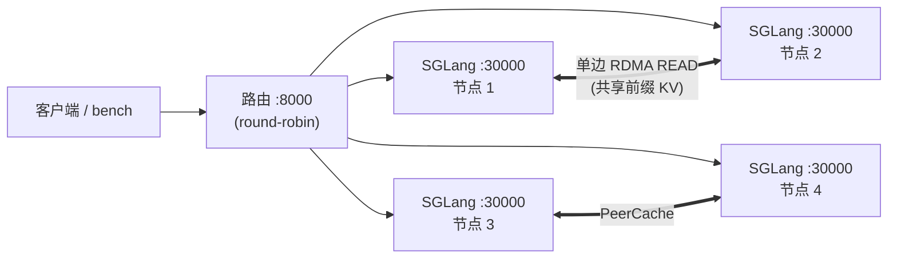

# 示例:多机前缀缓存复用

一份手把手教程:把**4 个 SGLang 节点通过 PeerCache 共享同一份前缀 / KV 缓存**(聚合式、
**非 PD**)跑起来,并用 metrics **证明**跨节点缓存命中。

!!! info "这个 demo 演示什么"
    多个推理节点对共享前缀只算**一次**,然后通过 RDMA 在整个集群复用它的 KV——没有中心
    master,也没有 PD 搬运引擎。你会看到 PeerCache 的 `write_requests`、`read_hits`、
    `read_remote_hits` 计数往上涨。

## 组网拓扑

| 角色 | 主机 | 备注 |
|---|---|---|
| 节点 1 | `<NODE1_IP>` | 兼内嵌 PeerCache meta **和**路由 |
| 节点 2 | `<NODE2_IP>` | |
| 节点 3 | `<NODE3_IP>` | |
| 节点 4 | `<NODE4_IP>` | |



## 前置条件

- 4 台带 **RDMA 网卡**(RoCE/IB)的机器,互相可达。记下设备名,如 `mlx5_0` 或
  `mlx5_bond_1..8`,并在**每台用相同顺序**(rail 按下标配对)。
- 已装 **SGLang**(支持 `--enable-hierarchical-cache`)。
- 每台相同路径下有模型和 tokenizer。
- 节点间放行 TCP:发现端口 `31998`、服务端口 `30000`、路由端口 `8000`、metrics 端口 `31997`。

## 第 1 步 — 四台都装 PeerCache

```bash
pip install -U peercache            # RDMA 构建(需 libibverbs/librdmacm)
python -c "from peercache import _peercache as m; assert m.HAS_RDMA"
ulimit -l unlimited                 # 允许 pin RDMA 内存
```

## 第 2 步 — 每台设置共享变量

每台 shell 都设。**只有 `SELF` 各机不同。**

```bash
MODEL=/path/to/your/model                 # 每台路径相同
DEVS=mlx5_bond_1,mlx5_bond_2,mlx5_bond_3,mlx5_bond_4,mlx5_bond_5,mlx5_bond_6,mlx5_bond_7,mlx5_bond_8
DISC=<NODE1_IP>:31998                      # 四台一致;节点 1 自动内嵌 meta
SELF=<本机 IP>                             # 节点1填 <NODE1_IP>,节点2填 <NODE2_IP> ...
TP=1                                       # 模型需要多卡就调大

PC='{"backend_name":"peercache","module_path":"peercache.store","class_name":"PeerCacheStore","discovery_addr":"'$DISC'","protocol":"rdma","device_names":"'$DEVS'","local_hostname":"'$SELF'","global_segment_size":"16gb"}'
```

!!! tip "只有一张卡?"
    把 `"device_names":"'$DEVS'"` 换成 `"device_name":"mlx5_0"`(并去掉 `DEVS`)。多轨
    (`device_names`)是为了横跨多卡拿更大带宽。

## 第 3 步 — 每台起一个 SGLang 服务

**四台都跑**(**先起节点 1**,它托管 meta)。

```bash
pkill -9 -f sglang; sleep 2                       # 清掉残留 GPU 显存
export PYTORCH_CUDA_ALLOC_CONF=expandable_segments:True

CUDA_VISIBLE_DEVICES=0 python -m sglang.launch_server \
  --model-path $MODEL --tp-size $TP --trust-remote-code \
  --host 0.0.0.0 --port 30000 \
  --enable-hierarchical-cache \
  --hicache-write-policy write_through \
  --hicache-ratio 1.2 \
  --hicache-storage-backend dynamic \
  --hicache-storage-backend-extra-config "$PC"
```

这几个 flag 对 demo 很关键:

- `--hicache-write-policy write_through` — **KV 一产出就写进 PeerCache**,而不是等 host
  缓存淘汰才写。不加这个、host 层又大时,L3 经常一直是空的(`write_requests=0`)。
- `--hicache-ratio 1.2` — 把 host(L2)层压小,让页真正下沉到 PeerCache(L3)。

每台服务日志里应看到 PeerCache 起来:

```
This node hosts the embedded PeerCache meta/discovery service on 0.0.0.0:31998   (仅节点 1)
PeerCacheStore up: node=<ip>-xxxx rdma=<ip>:<port> control=<ip>:<port> discovery=<NODE1_IP>:31998
PeerCacheStore registered MRs: recv=... bytes, pool=17179869184 bytes
```

!!! warning "绝不能出现 'using TCP fallback'"
    若看到 `RDMA transport unavailable ... using TCP fallback`,说明 RDMA 没起来——先修
    设备名 / GID 再继续(TCP 能用但不是性能路径)。同时确认有 `registered MRs ... pool=...`
    那行;没有就说明 PeerCache 没拿到 host 池。

## 第 4 步 — 节点 1 上起路由

```bash
python -m sglang_router.launch_server \
  --worker-urls http://<NODE1_IP>:30000 http://<NODE2_IP>:30000 \
                http://<NODE3_IP>:30000 http://<NODE4_IP>:30000 \
  --host 0.0.0.0 --port 8000 \
  --policy round_robin
```

!!! note "demo 为什么用 round-robin"
    `round_robin` 会把共享前缀的请求打散到**不同**节点,于是 B 节点必须通过 PeerCache 去拉
    A 节点的前缀 KV——正是我们要观察的跨节点路径(`read_remote_hits`)。生产环境通常选
    `cache_aware`(把复用留在本地,延迟最优),那时 PeerCache 主要服务溢出和再平衡。

    `sglang_router` 的 flag 各版本不同——`python -m sglang_router.launch_server --help` 为准。

## 第 5 步 — 打一个前缀重的负载

默认 ShareGPT 各 prompt 几乎不共享前缀,所以用 SGLang 的 **generated-shared-prefix**
负载:一组请求共享一段长 system prompt——理想的前缀缓存测试。

```bash
python -m sglang.bench_serving --backend sglang \
  --host <NODE1_IP> --port 8000 --model $MODEL \
  --dataset-name generated-shared-prefix \
  --gsp-num-groups 64 --gsp-prompts-per-group 16 \
  --gsp-system-prompt-len 2048 --gsp-question-len 128 --gsp-output-len 256 \
  --num-prompts 1024 --request-rate 8
```

(用自己的数据集,如 ShareGPT,改成 `--dataset-name sharegpt --dataset-path /路径/ShareGPT_V3_unfiltered_cleaned_split.json`;只是命中率会更低,因为前缀重叠少。)

## 第 6 步 — 确认命中

抓每台的 metrics,看 PeerCache 计数:

```bash
for ip in <NODE1_IP> <NODE2_IP> <NODE3_IP> <NODE4_IP>; do
  echo "== $ip =="
  curl -s http://$ip:31997/metrics | grep -E \
    'peercache_(members|write_requests|read_requests|read_hits|read_remote_hits|bytes_read|pool_keys)\b'
done
```

"跑通了"长这样:

| 计数 | 含义 | 期望 |
|---|---|---|
| `members` | 环里的节点数 | **4** |
| `write_requests` / `pool_keys` | 发布到 L3 的 KV 页 | **> 0 且增长** |
| `read_requests` / `read_hits` | L3 查找命中 | **> 0** |
| `read_remote_hits` | **从其他节点经 RDMA** 命中 | **> 0** ← 跨节点收益 |
| `bytes_read` | 经 RDMA 拉取的字节 | **> 0** |
| `rdma_read_timeouts` / `rdma_channel_discards` | 数据面错误 | **0** |

同样负载再跑第二遍,命中率应更高(前缀已被全集群缓存)。

## 量化收益(A/B 对比)

想量化 PeerCache 的价值,把**同一个**负载跑两遍:

1. **基线** — 启动服务时**去掉**那三个 `--hicache-*` flag(只用本地 radix 缓存),跑第 5 步,
   记 TTFT / 吞吐。
2. **带 PeerCache** — 用上面第 3 步的命令,再跑第 5 步。

对比 TTFT(中位/P99)和 input-token 吞吐:命中集群缓存的共享前缀能跳过 prefill 重算,
从而降 TTFT、升吞吐。

## 排查

| 现象 | 原因 / 解决 |
|---|---|
| 日志出现 `using TCP fallback` | RDMA 没起——`device_name` / `gid_index` 不对;查 `ibv_devinfo`、`show_gids`。 |
| PeerCache 计数全 `0` | L3 没流量。加 `--hicache-write-policy write_through`、调小 `--hicache-ratio`、并用**共享前缀**负载(第 5 步)。 |
| `pool_capacity_bytes = 0` / 无 `registered MRs` 行 | host 池没注册给后端——确认 `--enable-hierarchical-cache` 和 `dynamic` 后端配置;看启动日志。 |
| `read_remote_hits` 一直 `0`(但 `read_hits` > 0) | 复用都留在本地——把路由换成 `--policy round_robin`,让前缀散到各节点。 |
| `timed out waiting for the producer` / 环 < 4 | 发现不可达——放行节点间 TCP `31998`;确认四台用同一个 `discovery_addr`。 |
| 加载时 CUDA OOM | GPU 上有残留进程——`pkill -9 -f sglang; nvidia-smi`;或调大 `--tp-size`。 |
| `rdma_read_timeouts` 在涨 | fabric/GID/回环问题——核对 RoCEv2 GID,用 `ib_read_bw` 验证跨机 RDMA。 |

## 一图流

```
装 peercache → 设变量(SELF 各机不同)→ 起 4 个服务(先节点 1)
→ 节点 1 起 round-robin 路由 → 跑 generated-shared-prefix 负载
→ 在 :31997/metrics 看 read_remote_hits / write_requests
```

那个跨节点的 `read_remote_hits` 就是 PeerCache 的核心价值:前缀算一次,经 RDMA 处处复用。
什么时候划算见[定位与对比](positioning.md)。
