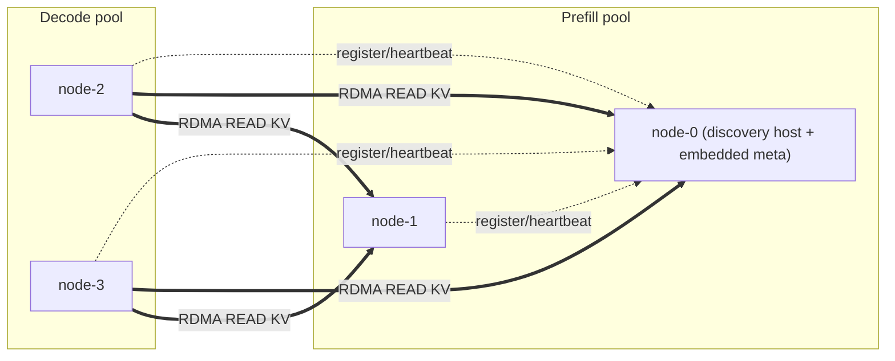

# Getting Started

PeerCache is the cross-node KV-cache transport for **PD-disaggregated SGLang
inference** (separate prefill and decode workers). Prefill nodes publish KV pages;
decode nodes read them back over RDMA. See [Architecture](architecture.md) for the
data flow and copy counts.

## Requirements

- Python 3.9+
- For the RDMA data plane: Linux with `rdma-core` / MLNX_OFED development headers
  (`libibverbs`, `librdmacm`), CMake ≥ 3.18, and a C++17 compiler.
- For functional testing without RDMA: nothing extra — the pure-Python TCP
  fallback transport is used automatically.

## Install

```bash
# Linux with RDMA NICs
pip install peercache            # once published to PyPI
# or from source
pip install git+https://github.com/flymysql/PeerCache.git

# Without RDMA (control plane + TCP fallback only, e.g. on a laptop / CI)
pip install -e . --config-settings=cmake.define.PEERCACHE_NO_RDMA=ON
```

PeerCache must be importable from the SGLang process:

```bash
python -c "import peercache; print(peercache.__version__)"
```

## 1. Pick the discovery host (embedded meta)

There is **no separate meta process to launch**. Choose one node to host service
discovery and set `discovery_addr` to that node's IP on *every* node. The node
whose IP matches `discovery_addr` detects this at startup and auto-hosts the
discovery service in-process; all other nodes connect to it as clients.

So the only decision here is: which node's IP goes into `discovery_addr`.

> Optional: if you'd rather run a dedicated discovery host (e.g. a node that does
> not serve SGLang), start one with `peercache-meta --bind 0.0.0.0:31998` and point
> `discovery_addr` at it. The embedded behavior is unaffected — whichever node's
> IP equals `discovery_addr` and is free to bind the port will host it.

## 2. Launch SGLang with the PeerCache backend

PeerCache plugs in through SGLang's **dynamic backend** mechanism — no SGLang
source changes required. Use the **same** `discovery_addr` on all nodes.

```bash
# On the chosen discovery node, NODE0_IP is its own IP -> it hosts meta in-process.
# On every other node, the same NODE0_IP just points them at NODE0.
python -m sglang.launch_server \
  --model-path <model> \
  --enable-hierarchical-cache \
  --hicache-storage-backend dynamic \
  --hicache-storage-backend-extra-config '{
    "backend_name": "peercache",
    "module_path":  "peercache.store",
    "class_name":   "PeerCacheStore",
    "discovery_addr": "NODE0_IP:31998",
    "protocol": "rdma",
    "device_name": "mlx5_0",
    "ib_port": 1,
    "gid_index": 3,
    "global_segment_size": "8gb"
  }'
```

## Deployment topology (PD disaggregation)

A typical PD-disaggregated cluster:



Rules of thumb:

- Run the **same** PeerCache backend config on every prefill and decode node, with
  the **same `discovery_addr`** everywhere.
- Pick one node's IP for `discovery_addr` (any reachable node — often a prefill
  node). That node auto-hosts the embedded meta; nothing else to launch.
- Size `global_segment_size` to how much published KV each node should keep
  resident (it is sliced across `tp_size`); larger pool = higher hit rate, more
  host RAM pinned.
- Use `protocol: rdma` in production; `protocol: tcp` only for functional testing.
- All nodes must be able to reach each other on the RDMA and control ports
  (`rdma_port` / `control_port`, auto-assigned by default) plus the discovery port.

## extra_config reference

Required keys (the dynamic-backend factory needs the first three):

| key | default | meaning |
|---|---|---|
| `backend_name` | — | must be `peercache` (required by the dynamic factory) |
| `module_path` | — | `peercache.store` (required) |
| `class_name` | — | `PeerCacheStore` (required) |
| `discovery_addr` | — | discovery host `host:port`, **same on all nodes**; the node whose IP matches auto-hosts meta (**required**) |

RDMA / transport:

| key | default | meaning |
|---|---|---|
| `protocol` | `rdma` | `rdma` (production) or `tcp` (fallback transport for testing) |
| `device_name` | `""` | RDMA device, e.g. `mlx5_0`; empty = first active device |
| `ib_port` | `1` | HCA port |
| `gid_index` | `3` | GID index (RoCE v2 is typically 3) |
| `max_channels_per_peer` | `16` | max concurrent data-plane channels per peer (RDMA QP+CQ, or TCP sockets in fallback). Bounds parallel readers to one peer; extra threads briefly wait for a free channel |

Capacity / placement:

| key | default | meaning |
|---|---|---|
| `global_segment_size` | `4gb` | published-pool (memory) size per node (accepts `int` or `"8gb"`/`"512mb"`; sliced across `tp_size`) |
| `vnodes` | `160` | virtual nodes per node on the consistent-hash ring |
| `directory_replicas` | `1` | replicate directory entries to N owners for HA when `> 1` |

Disk persistence tier (L4):

| key | default | meaning |
|---|---|---|
| `disk_enabled` | `true` | spill evicted pages to disk and promote them back on read (degrades gracefully if `disk_path` can't be created) |
| `disk_path` | `/data/peercache/` | data directory (each node uses a `node_id` subdir) |
| `disk_size` | `100gb` | disk capacity per node (LRU-bounded; accepts `int` or `"100gb"`) |

Monitoring (metrics + dashboard):

| key | default | meaning |
|---|---|---|
| `metrics_enabled` | `true` | run the metrics server (Prometheus `/metrics` + dashboard) |
| `metrics_port` | `31997` | metrics/dashboard HTTP port (disabled if already bound, e.g. co-located ranks) |
| `metrics_bind_host` | `0.0.0.0` | metrics server bind interface |
| `metrics_dashboard` | `true` | also serve the built-in HTML dashboard at `/` |

Networking / identity (rarely need changing):

| key | default | meaning |
|---|---|---|
| `meta_bind_host` | `0.0.0.0` | interface the embedded meta binds when this node is the discovery host |
| `local_hostname` | auto | IP advertised to peers; auto-resolved as the local IP that can reach `discovery_addr` |
| `rdma_bind_host` | `0.0.0.0` | bind interface for the RDMA data plane |
| `rdma_port` | `0` | RDMA bootstrap port; `0` = auto-assign |
| `control_bind_host` | `0.0.0.0` | bind interface for the control RPC server |
| `control_port` | `0` | control RPC port; `0` = auto-assign |
| `node_id` | auto | stable node identifier; auto-generated from `local_hostname` + random suffix |
| `heartbeat_interval` | `2.0` | seconds between membership heartbeats |
| `member_ttl` | `6.0` | seconds before a silent node is pruned by the meta |

## Persistence and monitoring

With the disk tier on (default), each node spills published pages to
`disk_path/<node_id>/` and promotes them back on read, so capacity is effectively
memory (`global_segment_size`) + disk (`disk_size`). See
[Architecture → Disk persistence tier](architecture.md#disk-persistence-tier-l4).

Each node also serves metrics by default:

```bash
# Prometheus scrape target
curl http://NODE_IP:31997/metrics
# Built-in dashboard in a browser
open http://NODE_IP:31997/
```

Point Prometheus at `NODE_IP:31997` (or scrape every node) to chart hit rate,
throughput, latency p50/p99, and pool/disk usage. See
[Architecture → Monitoring](architecture.md#monitoring-metrics-dashboard).

## TCP fallback (no RDMA)

Set `"protocol": "tcp"` to validate the full discovery + directory + pool design
without RDMA hardware. Data is still read remotely into the destination buffer,
just over TCP instead of one-sided RDMA. Use this for functional testing only.

## Run the tests

```bash
pip install pytest
pytest -q          # uses the TCP fallback; no RDMA hardware required
```
