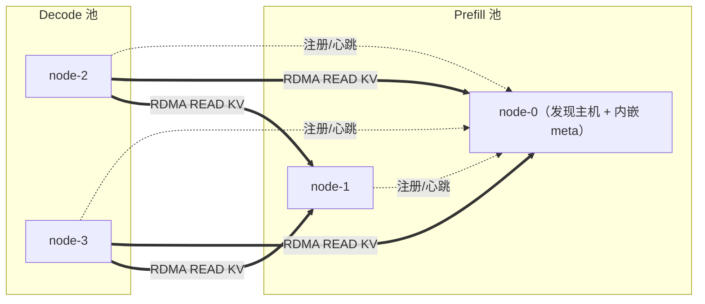

# 快速开始

PeerCache 是面向 **PD 分离（prefill/decode 分离）的 SGLang 推理**的跨节点 KV 缓存
传输层：prefill 节点发布 KV 页面，decode 节点通过 RDMA 读回。数据流与拷贝次数详见
[架构](architecture.md)。

## 环境要求

- Python 3.9+
- RDMA 数据面：Linux，安装 `rdma-core` / MLNX_OFED 开发头文件
  （`libibverbs`、`librdmacm`），CMake ≥ 3.18，以及支持 C++17 的编译器。
- 无 RDMA 的功能性测试：无需额外依赖 —— 会自动使用纯 Python 的 TCP 回退传输。

## 安装

```bash
# 带 RDMA 网卡的 Linux
pip install peercache            # 发布到 PyPI 后
# 或从源码安装
pip install git+https://github.com/flymysql/PeerCache.git

# 无 RDMA（仅控制面 + TCP 回退，例如笔记本 / CI）
pip install -e . --config-settings=cmake.define.PEERCACHE_NO_RDMA=ON
```

PeerCache 必须能被 SGLang 进程导入：

```bash
python -c "import peercache; print(peercache.__version__)"
```

## 1. 选定服务发现主机（内嵌 meta）

**无需单独启动 meta 进程。** 选定一个节点承担服务发现，并在*每个*节点上把
`discovery_addr` 配置为该节点的 IP。IP 与 `discovery_addr` 相符的节点会在启动时
识别到这一点，并在进程内自动承担服务发现；其余节点作为客户端连接到它。

因此这里唯一的决策是：把哪个节点的 IP 写进 `discovery_addr`。

> 可选：如果你更希望使用一台不承载 SGLang 的专用发现主机，可在该机器上运行
> `peercache-meta --bind 0.0.0.0:9100` 并把 `discovery_addr` 指向它。内嵌行为不受
> 影响 —— 谁的 IP 等于 `discovery_addr` 且能成功绑定端口，谁就承担发现服务。

## 2. 用 PeerCache 后端启动 SGLang

PeerCache 通过 SGLang 的 **dynamic backend** 机制接入 —— 无需改动 SGLang 源码。
所有节点使用**相同**的 `discovery_addr`。

```bash
# 在选定的发现节点上，NODE0_IP 即其自身 IP -> 它在进程内承担 meta。
# 在其余每个节点上，相同的 NODE0_IP 只是把它们指向 NODE0。
python -m sglang.launch_server \
  --model-path <model> \
  --enable-hierarchical-cache \
  --hicache-storage-backend dynamic \
  --hicache-storage-backend-extra-config '{
    "backend_name": "peercache",
    "module_path":  "peercache.store",
    "class_name":   "PeerCacheStore",
    "discovery_addr": "NODE0_IP:9100",
    "protocol": "rdma",
    "device_name": "mlx5_0",
    "ib_port": 1,
    "gid_index": 3,
    "global_segment_size": "8gb"
  }'
```

## 部署拓扑（PD 分离）

一个典型的 PD 分离集群：



经验法则：

- 在每个 prefill 和 decode 节点上运行**相同**的 PeerCache 后端配置，且
  **`discovery_addr` 处处一致**。
- 为 `discovery_addr` 选定某个节点的 IP（任意可达节点，通常是某个 prefill 节点）。
  该节点会自动承担内嵌 meta，无需另外启动任何东西。
- 按每个节点应常驻多少已发布 KV 来设置 `global_segment_size`（它会按 `tp_size`
  切分）；池越大命中率越高，但锁定的主机内存也越多。
- 生产用 `protocol: rdma`；`protocol: tcp` 仅用于功能性测试。
- 所有节点之间必须能互相访问 RDMA 端口、控制端口（`rdma_port` / `control_port`，
  默认自动分配）以及发现端口。

## extra_config 参数参考

必填项（dynamic 工厂需要前三项）：

| 键 | 默认值 | 含义 |
|---|---|---|
| `backend_name` | — | 必须为 `peercache`（dynamic 工厂要求） |
| `module_path` | — | `peercache.store`（必填） |
| `class_name` | — | `PeerCacheStore`（必填） |
| `discovery_addr` | — | 发现主机 `host:port`，**所有节点一致**；IP 相符的节点自动承担 meta（**必填**） |

RDMA / 传输：

| 键 | 默认值 | 含义 |
|---|---|---|
| `protocol` | `rdma` | `rdma`（生产）或 `tcp`（测试用回退传输） |
| `device_name` | `""` | RDMA 设备，如 `mlx5_0`；为空则取第一个激活设备 |
| `ib_port` | `1` | HCA 端口 |
| `gid_index` | `3` | GID 索引（RoCE v2 通常为 3） |
| `max_channels_per_peer` | `16` | 每个对端的最大并发数据面通道数（RDMA 为 QP+CQ；TCP 回退为 socket）。限制对单个对端的并行读取数；超出的线程会短暂等待空闲通道 |

容量 / 放置：

| 键 | 默认值 | 含义 |
|---|---|---|
| `global_segment_size` | `4gb` | 每节点发布池（内存）大小（接受 `int` 或 `"8gb"`/`"512mb"`；按 `tp_size` 切分） |
| `vnodes` | `160` | 一致性哈希环上每节点的虚拟节点数 |
| `directory_replicas` | `1` | `> 1` 时把目录条目复制到 N 个归属者以实现高可用 |

磁盘持久化分层（L4）：

| 键 | 默认值 | 含义 |
|---|---|---|
| `disk_enabled` | `true` | 把被淘汰的页面落盘，并在读取时提升回内存（若 `disk_path` 无法创建则优雅降级） |
| `disk_path` | `/data/peercache/` | 数据落盘目录（每个节点使用一个 `node_id` 子目录） |
| `disk_size` | `100gb` | 每节点磁盘容量（按 LRU 约束；接受 `int` 或 `"100gb"`） |

监控（metrics + 可视化页面）：

| 键 | 默认值 | 含义 |
|---|---|---|
| `metrics_enabled` | `true` | 启动 metrics 服务（Prometheus `/metrics` + 可视化页面） |
| `metrics_port` | `31997` | metrics/可视化 HTTP 端口（若已被占用，例如同机多 rank，则自动禁用） |
| `metrics_bind_host` | `0.0.0.0` | metrics 服务绑定接口 |
| `metrics_dashboard` | `true` | 同时在 `/` 提供内置 HTML 可视化页面 |

网络 / 身份（一般无需修改）：

| 键 | 默认值 | 含义 |
|---|---|---|
| `meta_bind_host` | `0.0.0.0` | 本节点作为发现主机时，内嵌 meta 绑定的网卡接口 |
| `local_hostname` | 自动 | 对外公告的 IP；自动解析为能到达 `discovery_addr` 的本机 IP |
| `rdma_bind_host` | `0.0.0.0` | RDMA 数据面绑定接口 |
| `rdma_port` | `0` | RDMA 引导端口；`0` 表示自动分配 |
| `control_bind_host` | `0.0.0.0` | 控制 RPC 服务器绑定接口 |
| `control_port` | `0` | 控制 RPC 端口；`0` 表示自动分配 |
| `node_id` | 自动 | 稳定的节点标识；由 `local_hostname` + 随机后缀自动生成 |
| `heartbeat_interval` | `2.0` | 成员心跳间隔（秒） |
| `member_ttl` | `6.0` | meta 将静默节点剔除前的等待秒数 |

## 持久化与监控

开启磁盘分层后（默认开启），每个节点会把发布的页面落盘到
`disk_path/<node_id>/`，并在读取时提升回内存，因此有效容量约等于内存
（`global_segment_size`）+ 磁盘（`disk_size`）。详见[架构](architecture.md)。

每个节点默认还会提供 metrics：

```bash
# Prometheus 抓取目标
curl http://NODE_IP:31997/metrics
# 浏览器打开内置可视化页面
open http://NODE_IP:31997/
```

把 Prometheus 指向 `NODE_IP:31997`（或抓取每个节点）即可绘制命中率、吞吐、时延
p50/p99 以及内存/磁盘用量。详见[架构](architecture.md)。

## TCP 回退（无 RDMA）

设置 `"protocol": "tcp"` 可在没有 RDMA 硬件的情况下验证完整的发现 + 目录 + 发布池
设计。数据仍会被远程读入目标缓冲区，只是走 TCP 而非单边 RDMA。仅用于功能性测试。

## 运行测试

```bash
pip install pytest
pytest -q          # 使用 TCP 回退；无需 RDMA 硬件
```
