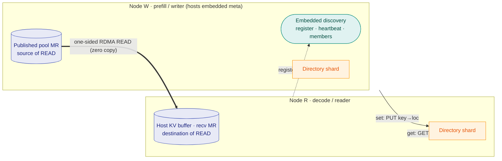

# PeerCache

**Peer-to-peer RDMA zero-copy L3 KV-cache backend for SGLang HiCache.**

PeerCache gives you Mooncake-style RDMA zero-copy KV-cache sharing across nodes,
but **without** the centralized `master` + `metadata` services. It is built for
**PD-disaggregated (prefill/decode) SGLang inference**: prefill workers publish KV
pages, and decode workers read them back over RDMA with zero CPU copies.

The directory is sharded across **every** node (here the example key is owned by
Node R's shard); each node also hosts a shard of its own. Discovery is embedded
in the `discovery_addr` node — no separate meta process.

## Why PeerCache?

| | Mooncake | PeerCache |
|---|---|---|
| metadata | central master + metadata service | sharded directory (consistent hash) |
| data placement | dedicated managed pool | stays on the producing node |
| coordination | master allocates / tracks objects | only service discovery, embedded in a node |
| transfer | RDMA zero-copy | RDMA zero-copy (one-sided READ) |

## Performance at a glance

Measured cross-host on RDMA (GET, MLA; 2× AMD EPYC 9K84 + 8× ConnectX-7, RoCEv2,
MTU 4096):

| scenario | GET throughput |
|---|---|
| single NIC, PeerCache | **46.0 GB/s** — **~94%** of bare `ib_read_bw` (49.0 GB/s) |
| single process, 8 rails (1 MiB pages) | **147.6 GB/s** (1.18 Tbps) |
| full machine, 8 NICs, multi-process | **273.0 GB/s** (≈ 2.18 Tbps) |

See the [Performance baseline](performance.md) for charts, methodology, and
reproduce commands.

## Core ideas

- **Embedded discovery, no separate meta node** — you set `discovery_addr` to one
  node's IP on every node; that node auto-hosts the discovery service in-process.
  Nodes register, heartbeat, and pull the live membership list. No data and no
  metadata live there.
- **Consistent-hash directory (DHT)** — the mapping
  `key -> {data_node, remote_addr, rkey, length}` is sharded across all nodes by
  hashing the key.
- **Data stays local on write** — `set()` copies the page into a node-local
  *published pool* (a host memcpy, no network, no master) and pushes only a tiny
  location record to the directory.
- **One-sided RDMA READ on read** — `get()` looks up the directory, then issues a
  zero-copy `IBV_WR_RDMA_READ` straight into SGLang's registered host buffer.
- **Disk persistence tier (L4)** — pages evicted from memory spill to disk
  (default `/data/peercache/`, `100GB`) and are promoted back into the pool on a
  later read, locally or by a remote reader.
- **Built-in monitoring** — a Prometheus `/metrics` endpoint plus an embedded HTML
  dashboard (default port `31997`): hit rate, throughput, latency p50/p99,
  memory/disk usage, and more.

## Next steps

- [Getting Started](getting-started.md) — install and run with SGLang.
- [Architecture](architecture.md) — the two-MR model, the directory, and the
  read/write data flows.
- [SDK Reference](sdk.md) — the Python and C++ APIs you can build on.
