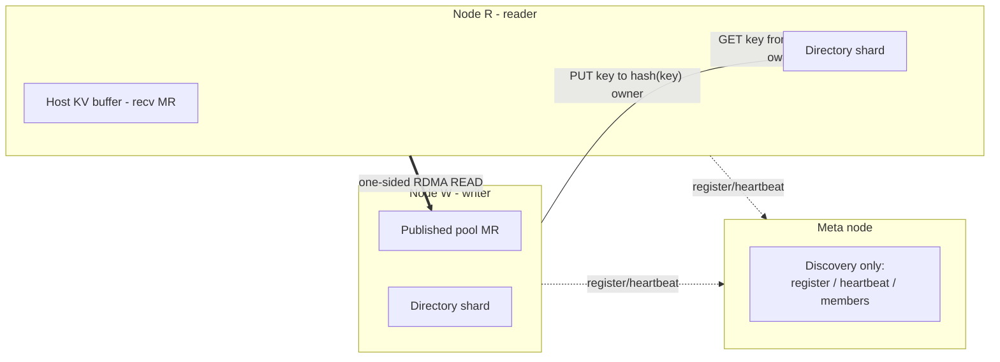

# PeerCache

**Peer-to-peer RDMA zero-copy L3 KV-cache backend for SGLang HiCache.**

PeerCache gives you Mooncake-style RDMA zero-copy KV-cache sharing across nodes,
but **without** the centralized `master` + `metadata` services.

## Why PeerCache?

| | Mooncake | PeerCache |
|---|---|---|
| metadata | central master + metadata service | sharded directory (consistent hash) |
| data placement | dedicated managed pool | stays on the producing node |
| coordination | master allocates / tracks objects | only service discovery on meta node |
| transfer | RDMA zero-copy | RDMA zero-copy (one-sided READ) |

## Core ideas

- **One meta node for discovery only** — nodes register, heartbeat, and pull the
  live membership list. No data and no metadata live there.
- **Consistent-hash directory (DHT)** — the mapping
  `key -> {data_node, remote_addr, rkey, length}` is sharded across all nodes by
  hashing the key.
- **Data stays local on write** — `set()` copies the page into a node-local
  *published pool* (a host memcpy, no network, no master) and pushes only a tiny
  location record to the directory.
- **One-sided RDMA READ on read** — `get()` looks up the directory, then issues a
  zero-copy `IBV_WR_RDMA_READ` straight into SGLang's registered host buffer.

## Next steps

- [Getting Started](getting-started.md) — install and run with SGLang.
- [Architecture](architecture.md) — the two-MR model, the directory, and the
  read/write data flows.
- [SDK Reference](sdk.md) — the Python and C++ APIs you can build on.
