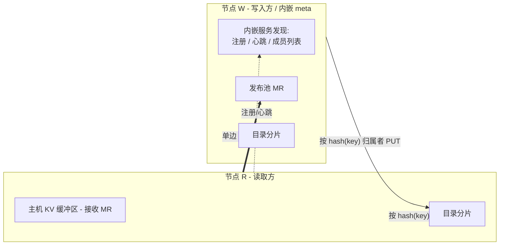

# PeerCache

**面向 SGLang HiCache 的点对点 RDMA 零拷贝 L3 KV 缓存后端。**

PeerCache 提供与 Mooncake 类似的跨节点 RDMA 零拷贝 KV 缓存共享能力，但
**省去**了中心化的 `master` 与 `metadata` 服务。

## 为什么选择 PeerCache？

| | Mooncake | PeerCache |
|---|---|---|
| 元数据 | 中心 master + metadata 服务 | 分片目录（一致性哈希） |
| 数据放置 | 专用托管内存池 | 留在生产数据的节点本地 |
| 协调 | master 分配 / 跟踪对象 | 仅服务发现，内嵌于某个节点 |
| 传输 | RDMA 零拷贝 | RDMA 零拷贝（单边 READ） |

## 核心理念

- **内嵌服务发现，无独立 meta 节点** —— 在所有节点上把 `discovery_addr` 配置为
  同一个节点的 IP；该节点会在进程内自动承担服务发现。节点向其注册、心跳并拉取
  实时成员列表。这里不存放任何数据，也不存放任何元数据。
- **一致性哈希目录（DHT）** —— 映射
  `key -> {数据节点, 远端地址, rkey, 长度}` 通过对 key 取哈希分片到所有节点。
- **写入时数据留本地** —— `set()` 把页面拷贝进节点本地的*发布池*（一次主机
  memcpy，不走网络、不依赖 master），仅把一条极小的位置记录推送到目录。
- **读取时单边 RDMA READ** —— `get()` 先查目录，再发起一次零拷贝
  `IBV_WR_RDMA_READ`，数据直接落入 SGLang 已注册的主机缓冲区。

## 下一步

- [快速开始](getting-started.md) —— 安装并与 SGLang 一起运行。
- [架构](architecture.md) —— 双 MR 模型、目录以及读写数据流。
- [SDK 参考](sdk.md) —— 可在其上构建的 Python 与 C++ API。
