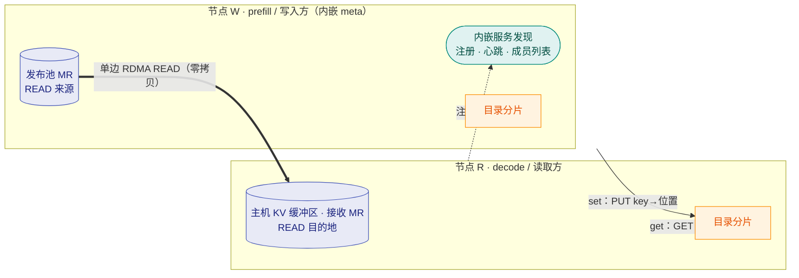

# PeerCache

**面向 SGLang HiCache 的点对点 RDMA 零拷贝 L3 KV 缓存后端。**

PeerCache 提供与 Mooncake 类似的跨节点 RDMA 零拷贝 KV 缓存共享能力，但
**省去**了中心化的 `master` 与 `metadata` 服务。它面向 **PD 分离（prefill/decode
分离）的 SGLang 推理**：prefill worker 发布 KV 页面，decode worker 通过 RDMA 读回，
且零 CPU 拷贝。

目录分片在**每个**节点上(此例中该 key 归属节点 R 的分片);每个节点也各自托管一个分片。
服务发现内嵌在 `discovery_addr` 指向的节点上——没有独立的 meta 进程。

## 为什么选择 PeerCache？

| | Mooncake | PeerCache |
|---|---|---|
| 元数据 | 中心 master + metadata 服务 | 分片目录（一致性哈希） |
| 数据放置 | 专用托管内存池 | 留在生产数据的节点本地 |
| 协调 | master 分配 / 跟踪对象 | 仅服务发现，内嵌于某个节点 |
| 传输 | RDMA 零拷贝 | RDMA 零拷贝（单边 READ） |

PeerCache 是**去中心化的前缀/KV 复用缓存**——不是 PD 搬运引擎。它的定位、与中心化存储的
取舍、以及何时该选别的方案,见[定位与对比](positioning.md)。

## 性能速览

跨机 RDMA 实测（GET，MLA；2× AMD EPYC 9K84 + 8× ConnectX-7，RoCEv2，MTU 4096）：

| 场景 | GET 吞吐 |
|---|---|
| 单卡，PeerCache | **46.0 GB/s** —— 裸 `ib_read_bw`（49.0 GB/s）的 **~94%** |
| 单进程，8 rail（1 MiB 页） | **147.6 GB/s**（1.18 Tbps） |
| 整机，8 卡，多进程 | **413.1 GB/s**（≈ 3.3 Tbps） |

图表、方法论与复现命令见 [性能基线](performance.md)。

## 核心理念

- **内嵌多主服务发现，无独立 meta 节点** —— `discovery_addr` 仍只配**一个 head
  `host:port`**(引导锚点)。每个 host 都在进程内运行服务发现;**head 被钉为首席
  master**,随着节点加入,再按主机名顺序把后续 host 提升,凑满 `max_masters`(默认
  3)个主。非 head 的 master 挂掉会自动由下一个 host 顶上,节点数不足时全员皆
  master——对运行中的节点无单点故障。节点向其注册、心跳并拉取实时成员列表。这里
  不存放任何数据,也不存放任何元数据。
- **一致性哈希目录（DHT）** —— 映射
  `key -> {数据节点, 远端地址, rkey, 长度}` 通过对 key 取哈希分片到所有节点。
- **写入时数据留本地** —— `set()` 把页面拷贝进节点本地的*发布池*（一次主机
  memcpy，不走网络、不依赖 master），仅把一条极小的位置记录推送到目录。
- **读取时单边 RDMA READ** —— `get()` 先查目录，再发起一次零拷贝
  `IBV_WR_RDMA_READ`，数据直接落入 SGLang 已注册的主机缓冲区。
- **磁盘持久化分层（L4）** —— 被内存淘汰的页面会落盘（默认 `/data/peercache/`，
  `100GB`），并在之后的读取时由本地或远端读取方提升回内存池。
- **内置监控** —— 提供 Prometheus `/metrics` 端点和内嵌 HTML 可视化页面（默认端口
  `31997`）：命中率、吞吐、时延 p50/p99、内存/磁盘用量等。

## 下一步

- [快速开始](getting-started.md) —— 安装并与 SGLang 一起运行。
- [架构](architecture.md) —— 双 MR 模型、目录以及读写数据流。
- [SDK 参考](sdk.md) —— 可在其上构建的 Python 与 C++ API。
