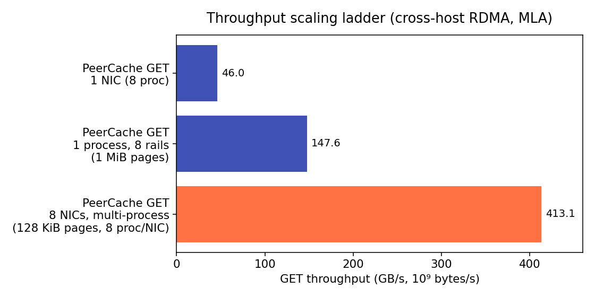
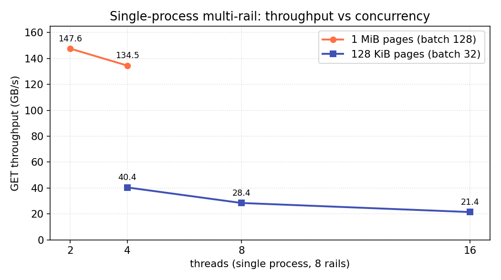
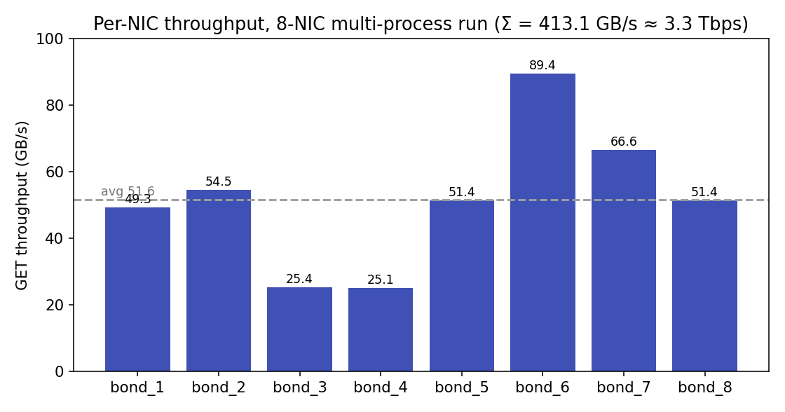

# 性能基线

本页记录 PeerCache GET 路径(单边 RDMA READ 读取 KV 页,MLA 布局)的一份**跨机
RDMA** 性能基线,使用内置的 `peercache-bench serve` / `drive` 双机工具测得。它展示
三种规模以及各自的瓶颈:

1. **单张网卡**(PeerCache 对比裸 `ib_read_bw`),
2. **单进程跨多卡**(multi-rail),
3. **整机**(多进程跨全部网卡)。

!!! note "这些是某集群上的示例数据"
    下面的数字来自一套特定的 8 卡 RoCE 环境(见
    [测试环境](#_2))。请把它当作*方法论与曲线形态*的参考,而非保证——用
    [复现](#_4)里的命令在你自己的硬件上重跑。

## 总览

<figure markdown>
  
  <figcaption>从单卡到整机的 GET 吞吐。</figcaption>
</figure>

| 场景 | GET 吞吐 | 占单卡裸 RDMA | 说明 |
|---|---|---|---|
| 裸 `ib_read_bw`,1 卡,16 QP | **49.0 GB/s**(392 Gbps) | 100% | 单卡硬件上限 |
| PeerCache,1 卡,8 进程 | **46.0 GB/s**(368 Gbps) | 94% | 存储层开销 ≈ 6% |
| PeerCache,**单进程**,8 rail,1 MiB 页 | **147.6 GB/s**(1.18 Tbps) | — | 受 GIL 限制;约 3 张卡的量 |
| PeerCache,**8 卡**,多进程,1 MiB 页 | **273.0 GB/s**(2.18 Tbps) | — | 约为 8 卡裸上限的 70% |

结论:PeerCache 在单卡上达到 **裸 `ib_read_bw` 的 ~94%**,单台机器跨 8 卡可聚合到
**0.27 TB/s**。

## 测试环境

| 项 | 值 |
|---|---|
| 拓扑 | 2 台主机(生产者 / 消费者),跨机 RoCE |
| 网卡 | 8 × Mellanox `mlx5` RoCE,bond(`mlx5_bond_1..8`) |
| RoCE | RoCEv2,GID index 3,**MTU 4096** |
| 单卡线速 | ≈ 400 Gb/s(裸 READ 实测 392 Gbps) |
| 系统 / 内核 | Linux 5.4.241-1-tlinux4-0017.7, x86_64, glibc 2.35 |
| CPU | 2 × AMD EPYC 9K84,96 核/路(192 核 / 384 线程) |
| 主机内存 | 2.2 TB(每 NUMA 节点 ≈ 1.16 TB) |
| NUMA 拓扑 | 2 节点;网卡 1–4 → node 0,5–8 → node 1;节点距离 10(本地)/ 32(远端) |
| 网卡型号 / 固件 | Mellanox ConnectX-7(board `MT_0000000834`),FW 28.39.1002 |
| rdma-core / OFED | MLNX_OFED 5.8-2.0.3.0 |
| PeerCache | 0.5.x(RDMA 构建) |
| 传输 | `--protocol rdma`,布局 `mla` |

??? info "采集环境信息的命令(填上面的空)"
    ```bash
    # 网卡型号、固件、速率、MTU
    ibv_devinfo -d mlx5_bond_1 -v | grep -Ei "hca_id|fw_ver|active_mtu|rate|board"
    # RoCEv2 GID 表(确认 v2 IPv4 的 index)
    show_gids mlx5_bond_1
    # 网卡 <-> NUMA 节点映射
    for d in mlx5_bond_{1..8}; do echo -n "$d numa="; cat /sys/class/infiniband/$d/device/numa_node; done
    # CPU / NUMA 拓扑与内存
    lscpu | grep -Ei "model name|socket|numa|core"
    numactl -H | head -20
    free -g
    # OFED / rdma-core
    ofed_info -s 2>/dev/null || rpm -q rdma-core 2>/dev/null || dpkg -l | grep -i rdma-core
    uname -r
    ```

## 1 · 单卡 —— PeerCache 对比裸 RDMA

为衡量存储层的开销,把单卡的 PeerCache 与裸 fabric 对比:

| 测量 | GET 吞吐 |
|---|---|
| `ib_read_bw -q 16 -s 131072`(裸单边 READ) | 49.0 GB/s(392 Gbps) |
| PeerCache GET,128 KiB 页,8 进程 × 4 线程 | 46.0 GB/s(368 Gbps) |

PeerCache 落在裸 `ib_read_bw` 的 **~6%** 以内。这点差距是目录查找 + 每批编排;开启
`--dir-cache-ttl` 后,热的、静态的工作集上目录 RPC 基本被摊掉。

## 2 · 单进程多卡(multi-rail)

设置 `--devices d1,…,d8`,一个进程就会**每卡开一条 rail**,并在一次释放 GIL 的 C++
调用(`batch_read_multi`)里把每批 READ 横跨所有 rail 分发。

<figure markdown>
  
  <figcaption>单进程 8 rail:吞吐 vs 线程数,两种页大小。</figcaption>
</figure>

| 页大小 | batch | 峰值 | 最佳线程数 |
|---|---|---|---|
| 128 KiB | 32 | 40.4 GB/s | 4 |
| 1 MiB | 128 | **147.6 GB/s** | 2 |

两点值得注意:

- **单进程被 GIL 限制**:吞吐在*低*线程数(2–4)就到峰值,线程越多反而*下降*——每批的
  Python 编排被 GIL 串行化,加线程只增加争用。
- **大传输能摊薄这部分开销**:GIL 持有的开销是按*调用*算的,不是按字节,所以把页从
  128 KiB 加到 1 MiB,单进程从 40 → 148 GB/s(约 3 张卡的量)——尽管两者都受 GIL 限制。

所以 multi-rail 让一个进程能用上多张卡,但**单个 Python 进程无法吃满全部 8 卡**——那需要
多进程。

## 3 · 整机 —— 多进程跨 8 卡

生产形态(也是吃满每张卡的方式)是**每卡一个进程组**——正是 SGLang TP=8 部署的运行
方式(8 个 rank,各绑本地网卡)。这里:8 卡 × 每卡 4 个读进程,1 MiB 页。

<figure markdown>
  
  <figcaption>每张卡的 GET 吞吐;8 张合计 273.0 GB/s(≈ 2.18 Tbps)。</figcaption>
</figure>

| 指标 | 值 |
|---|---|
| **聚合 GET** | **273.0 GB/s(2.18 Tbps)** |
| 单卡区间 | 16.9 – 50.1 GB/s |
| 占 8 卡裸上限(≈ 392 GB/s) | ≈ 70% |

聚合远超单进程(147 → 273 GB/s),但**不再受网卡限制**——而是被主机内存带宽 / PCIe,以及
**不均衡**(两张卡只有 ~17 GB/s,其余 35–50)拖住。本机上网卡 1–4 在 NUMA node 0、5–8 在
node 1(远端节点距离 32,本地 10),没绑核的读进程可能落到错误的节点、付出跨 NUMA 代价。用
`numactl --cpunodebind=<n> --membind=<n>` 把每个进程组绑到该网卡的 NUMA 节点(复现脚本
在装了 `numactl` 时会这么做),并确认 bond 的两个子口都在跑流量;这应能把慢的网卡拉回来、
抬高聚合。

## 关键结论

- **单卡**:PeerCache ≈ 裸 `ib_read_bw` 的 **94%** —— RDMA 路径接近最优。
- **GIL 是单进程的天花板**:用**低线程数**+**大 batch/大页**把单进程压到最高;单进程吃不满
  全部网卡。
- **整机带宽需要多进程**(每卡一组),这与 SGLang 多 rank 部署形态一致。
- **超过约一张卡后,瓶颈转移到内存/PCIe/NUMA**,不再是 fabric —— 绑 NUMA、均衡 bond。

## 复现

两台主机都装 RDMA 构建(`pip install -U peercache`)。把设备名换成你的网卡,`PRODUCER_IP`
换成数据节点地址。

**单进程,8 rail(一台机器驱动多卡):**

```bash
# 生产者(数据节点)
peercache-bench serve --discovery-addr 0.0.0.0:31998 \
    --devices mlx5_bond_1,mlx5_bond_2,mlx5_bond_3,mlx5_bond_4,mlx5_bond_5,mlx5_bond_6,mlx5_bond_7,mlx5_bond_8 \
    --layout mla --page-size 1048576 --working-set 8192 --readers 1

# 消费者(驱动)
peercache-bench drive --discovery-addr PRODUCER_IP:31998 \
    --devices mlx5_bond_1,mlx5_bond_2,mlx5_bond_3,mlx5_bond_4,mlx5_bond_5,mlx5_bond_6,mlx5_bond_7,mlx5_bond_8 \
    --layout mla --page-size 1048576 --working-set 8192 \
    --batch-size 128 --concurrencies 2 --max-channels 32 \
    --dir-cache-ttl 5 --duration 10 --warmup 2 --op get
```

**整机,每卡一个进程组(聚合):** 每张卡起一对 `serve`/`drive`,各用独立 discovery
端口(`31998+i`),用 numactl 绑 NUMA,并行跑后把各卡的 `GB/s` 相加。现成的启动循环见
[bench README](https://github.com/flymysql/PeerCache/blob/main/python/peercache/bench/README.md)。

本页图表由
[`docs/assets/perf/make_charts.py`](https://github.com/flymysql/PeerCache/blob/main/docs/assets/perf/make_charts.py)
生成;刷新基线时更新里面的数据点即可。

## GPUDirect RDMA(读进 GPU 显存)

真实 SGLang 部署里 KV 缓冲区在 **GPU 显存**。PeerCache 可以注册该缓冲区,让单边 READ
**直接落进显存**(无需经过主机内存中转):

- 若缓冲区暴露 **dmabuf fd**,通过 `ibv_reg_dmabuf_mr` 注册;
- 否则注册设备虚拟地址(普通 MR),在加载了 **`nvidia-peermem`**(peer memory)时可用。

主机前置条件:支持 GPUDirect 的网卡 + 驱动(ConnectX + MOFED,并加载 `nvidia-peermem`
或具备 dmabuf 能力的栈)。用下面命令测量:

```bash
peercache-bench drive --discovery-addr PRODUCER_IP:31998 --device-name mlx5_bond_1 \
    --layout mla --page-size 131072 --working-set 4096 \
    --batch-size 32 --concurrencies 4 --duration 10 --warmup 2 --op get --gpu
```

`--gpu` 把读目的地分配在 GPU 显存;注册失败会抛出明确指出缺失前置条件的错误。

## 注意

1. **1 MiB 页是合成值**。真实 MLA KV 页通常约 128 KiB;1 MiB 的跑分展示的是*大传输时的
   余量*,不是生产页大小。引用数字时务必标注页大小。
2. **仅跨机有效**。单机跑用的是网卡回环、受软件限制,不代表 fabric 行为。
3. **TCP 不是性能场景** —— 它只用于功能验证。
4. 任何图表旁都应附上该次运行的 `host` + `meta` 块(设备列表、布局、页、batch、并发、
   进程数)。
